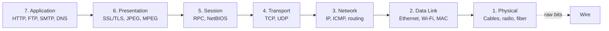
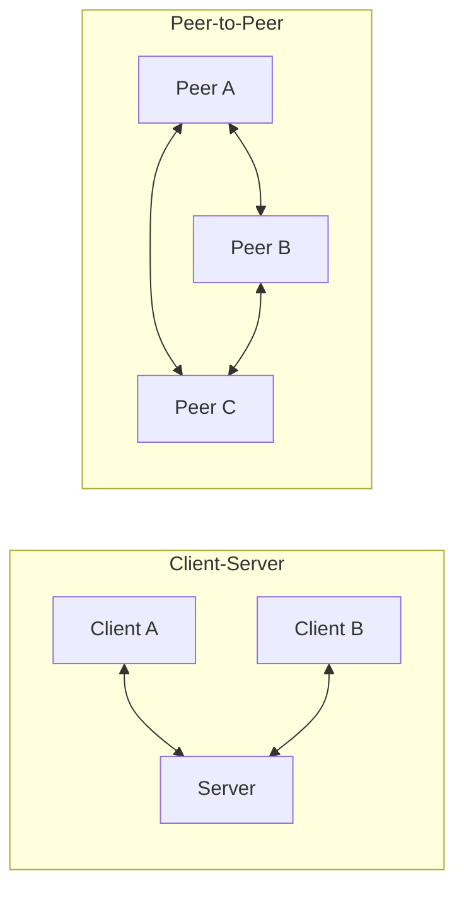
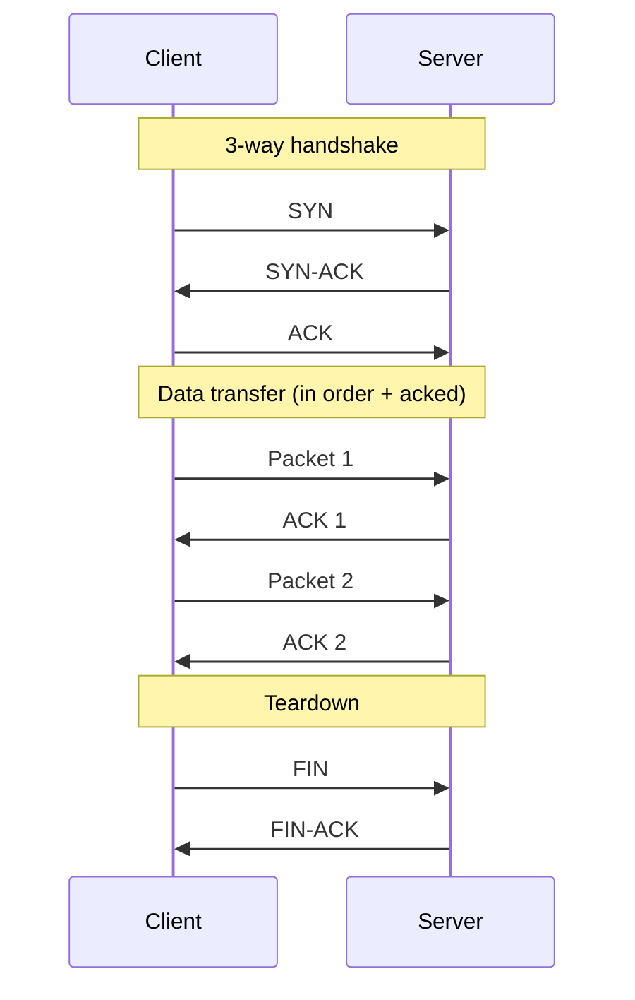
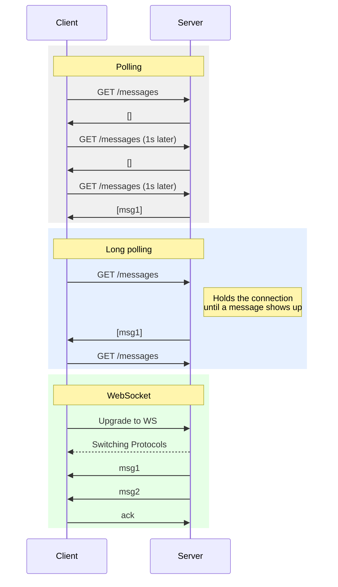
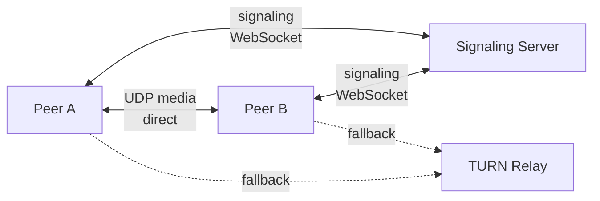

# Network Protocols

> **TL;DR** — The internet is built in layers. Each layer does one job and hides the mess below it. Pick your protocol based on **what matters most to you**: safe delivery (TCP), speed (UDP), live back-and-forth (WebSockets), or browser-to-browser (WebRTC).

## Key Takeaways

- The **OSI model** is just a way to think about networks. What actually runs on the internet is TCP/IP, which has 4–5 layers.
- **TCP** = safe, in-order, a bit slower. **UDP** = fast, but packets can be lost or arrive out of order.
- **HTTP** is ask-and-answer only — it's a bad fit when the server needs to push. Use **WebSockets** when both sides need to talk any time.
- **WebRTC** is the one browser-to-browser option people actually use — it powers Zoom, Google Meet, Discord voice.
- The protocol you pick shapes the whole system. A chat app using polling and one using WebSockets are two very different things.

## The OSI Model

A way to split networking into **seven layers**, each with one clear job. Each layer only talks to the layer right above and right below it.

| Layer         | Example Protocols | Job                                  |
|---------------|-------------------|-------------------------------------------------|
| Application   | HTTP, FTP, SMTP, DNS | The things apps and users see directly |
| Presentation  | SSL/TLS, JPEG     | Translate, encrypt, compress            |
| Session       | RPC, NetBIOS      | Start, manage, and end sessions             |
| Transport     | TCP, UDP          | Get data from one app to another, safely or fast        |
| Network       | IP, ICMP          | Find a path across networks     |
| Data Link     | Ethernet, Wi-Fi   | Move data to the next machine on the wire           |
| Physical      | Cables, fiber     | Actually send the bits                             |

### Why layers matter

- Each layer can change on its own. HTTP/2 can replace HTTP/1.1 without touching Ethernet.
- Debugging gets easier — you can figure out *which layer* is broken (Is DNS wrong? Is the TCP connection stuck? Is SSL failing?).
- **In real life:** when you open `google.com`, DNS (app) turns the name into an IP (network), TCP (transport) opens a connection, TLS (presentation) encrypts it, HTTP (app) carries the request, Ethernet (data link) moves it around your LAN, and the cable or radio (physical) actually sends the bits.

## Application Layer — Ways Two Things Can Talk

### Client-Server
One side always asks, the other side always answers.

- **HTTP / HTTPS** — the classic web.
- **FTP** — sending files.
- **SMTP** — sending email.
- **IMAP / POP3** — reading email.
- **WebSockets** — both sides can talk, but it's still one client talking to one server. Two clients **cannot** talk to each other directly over a WebSocket.

### Peer-to-Peer (P2P)
Everyone is both client and server.

- **WebRTC** — live audio, video, and data between browsers.
- **BitTorrent** — file sharing; whoever downloads also uploads.
- **Blockchain networks** — gossip-style P2P.

## Transport Layer — TCP vs UDP

### TCP (Transmission Control Protocol)

**Safe, in order, needs a connection first.** TCP promises that every byte you send will arrive in the right order, or the connection will fail loudly.

- **Handshake:** 3 messages (SYN → SYN-ACK → ACK) before any real data flows.
- **Order:** each packet has a number; if they arrive out of order, they get sorted.
- **Safety:** if a packet isn't acknowledged, it's sent again.
- **Flow control:** the receiver tells the sender how much it can handle, so the sender doesn't flood it.
- **Congestion control:** TCP slows down when the network looks busy (e.g. TCP Reno, CUBIC, BBR).

### UDP (User Datagram Protocol)

**Fast, no connection, no promises.** Send packets and hope for the best. The app has to handle anything that matters.

- No handshake — the first packet already has data.
- No ordering, no resends.
- Much lower delay and overhead.
- Use it when **late data is worse than no data** (live streaming, voice, video, games).

### Side-by-side

| Feature              | TCP                           | UDP                           |
|----------------------|-------------------------------|-------------------------------|
| Connection           | Yes, keeps state              | None                          |
| Handshake            | 3 messages (~1 round trip)    | None                          |
| Order                | Guaranteed                    | Not guaranteed                |
| Safety               | Acks + resends                | Send and forget               |
| Flow control         | Yes                           | No                            |
| Congestion control   | Yes                           | No (do it in the app)         |
| Header size          | 20+ bytes                     | 8 bytes                       |
| Speed                | Slower                        | Faster                        |
| Common uses          | Web, email, APIs, SSH         | Voice calls, games, streaming, DNS  |

### What real products use

| Product            | What it uses      | Why                                                    |
|--------------------|------------------|--------------------------------------------------------|
| Google search      | TCP (HTTP/2)     | Correct results matter more than a few milliseconds    |
| Netflix streaming  | TCP (HLS / DASH) | Uses TCP but switches quality to hide buffering|
| Zoom / Google Meet | UDP (WebRTC)     | A dropped frame is better than a late one              |
| Online FPS games   | UDP              | Position updates happen constantly; old ones are useless |
| DNS lookups        | UDP first        | Query is tiny; easy to retry if it fails               |
| SSH                | TCP              | You need every keystroke to arrive                              |

## Server-to-Client Push — HTTP vs WebSockets vs SSE

A question that comes up a lot: how does the **server send data to a client** without the client asking first?

| Way to do it      | How it works                                                            | Cost                           |
|-----------------|-------------------------------------------------------------------------|--------------------------------|
| Short polling   | Client asks every few seconds.                                          | Wasteful, and slow to react.   |
| Long polling    | Client asks, server holds the connection open until there's news or it times out.   | Still lots of HTTP overhead.           |
| SSE (Server-Sent Events) | One open HTTP stream; server → client only.                  | One direction only.                  |
| **WebSocket**   | One HTTP upgrade, then an open two-way channel.            | Best choice for live two-way chat. |

**Where it's used:**
- **Slack, WhatsApp Web, Discord** → WebSockets for live messages.
- **Stock tickers, trading dashboards** → WebSockets or SSE.
- **Notifications in most SaaS apps** → SSE or WebSockets.

## WebRTC — browsers talking to browsers

WebRTC is special because it lets **two browsers talk directly**, instead of sending all the audio and video through a server.

How it usually works:
1. Both sides connect to a **signaling server** (usually a WebSocket) to swap the info they need (SDP, ICE candidates).
2. A **STUN** server helps each side find out its public IP and port (NAT often hides it).
3. If STUN doesn't cut it (strict NAT or firewall), a **TURN** server passes the media through.
4. Once set up, audio and video flow directly, over UDP.

- **Used in:** Zoom (web), Google Meet, Discord voice, Messenger video calls, most telehealth apps.
- **What's different:** no media server needed for small calls. For group calls, media still goes through a central **SFU** server (see [12-zoom.md](12-zoom.md)).

## HTTP Versions

| Version  | Runs on | Main feature                                                |
|----------|-----------|------------------------------------------------------------|
| HTTP/1.1 | TCP       | One request per connection (pipelining rarely works).      |
| HTTP/2   | TCP       | Many streams sharing one TCP connection.          |
| HTTP/3   | UDP (QUIC)| Fixes TCP's "one lost packet blocks everything" problem; faster handshake (0-RTT).|

**Why HTTP/3 runs on UDP:** TCP's strict ordering means one lost packet stalls *every* parallel stream. QUIC (on UDP) sorts each stream on its own, so one loss doesn't block the others. Google, Cloudflare, and Facebook use it for most of their traffic.

## Interview-Ready Questions

1. *Why not use UDP for everything?* → No safety, no order, no congestion control — you'd have to build all that yourself.
2. *Why not TCP for video calls?* → Resends add delay; by the time the lost frame arrives, the moment is gone.
3. *WebSockets vs HTTP/2 server push?* → WebSocket is two-way and stays open. HTTP/2 push is one-way and often turned off. WebSockets win for chat and live editing.
4. *Why is DNS usually UDP?* → Queries fit in one small packet and are safe to retry. Only switch to TCP for big replies (zone transfers, DNSSEC).
