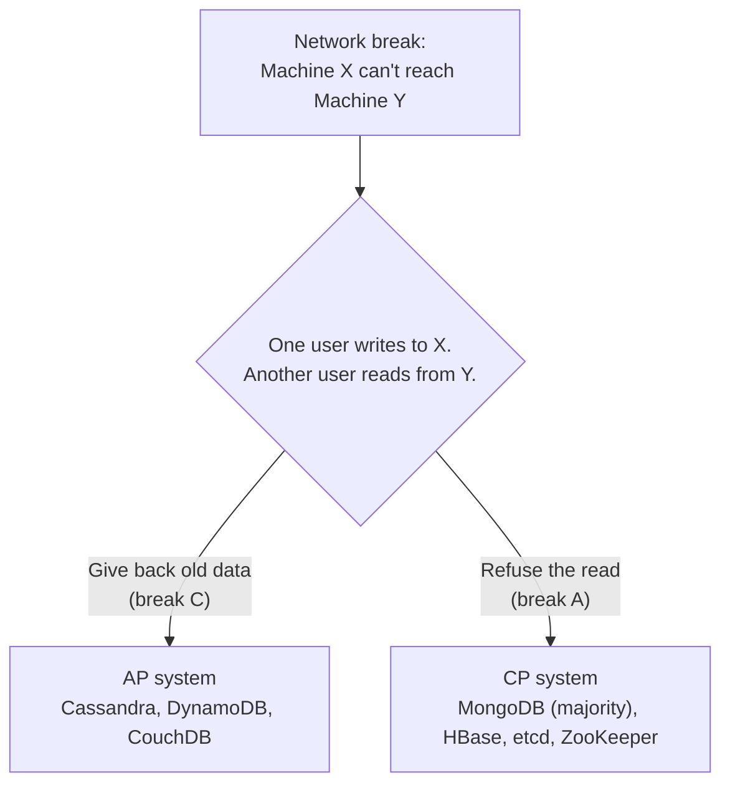
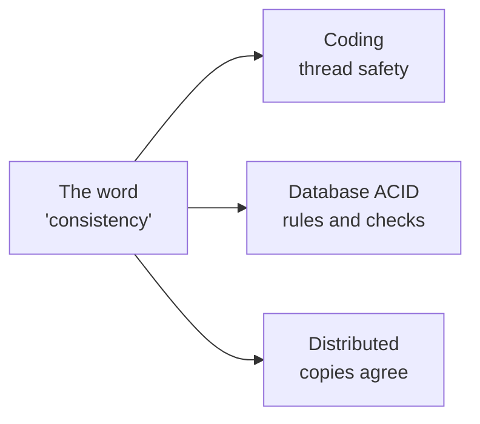
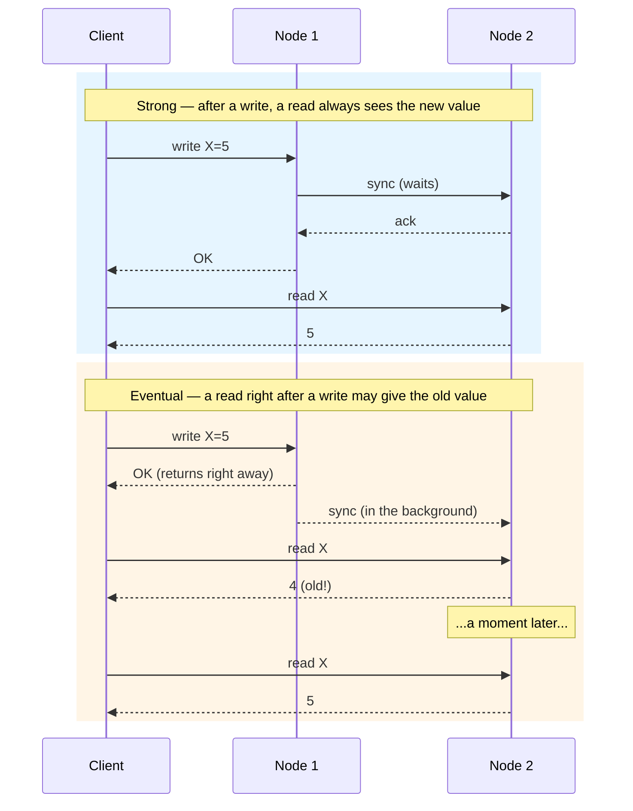
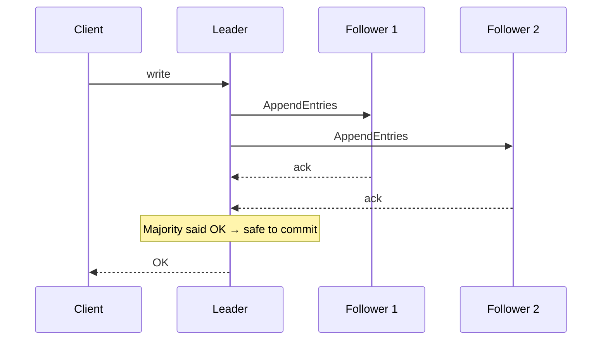

# CAP Theorem & Consistency

> **TL;DR** — When you run a system across many machines, the network between them will break sometimes. When that happens, you have to pick: keep serving people on both sides (even if they see old data), or stop one side until things are fixed. **Every real system mixes these choices — one answer per type of data.**

## Key Takeaways

- **CAP is not a "pick 2" menu.** Network breaks *will* happen, so for each piece of data you really pick either **CP** (correct) or **AP** (always up).
- **The word "consistency" means different things** in coding, in databases, and in distributed systems. Don't mix them up.
- **Strong consistency is expensive.** You pay for it with slower responses, less uptime, or both. Only use it when you truly need it (money, stock counts).
- **Eventual consistency is fine for most things** — feeds, search results, analytics.
- Most modern databases let you **decide per request** (for example, DynamoDB's `ConsistentRead`, Cassandra's consistency levels).

## CAP Theorem

Three things you want in a system with copies of data on many machines — and why you can't have all three at once.

| Property                 | Meaning in plain words                                                          |
|--------------------------|------------------------------------------------------------------|
| **C**onsistency          | Once a write is saved, every machine gives back the same answer. |
| **A**vailability         | Every machine always replies — either with data or a clear error.|
| **P**artition tolerance  | Things keep working even when machines can't talk to each other. |

> In the real world, network breaks happen. So the real choice is **CP or AP**.

### Why CA isn't really an option

Say the network splits your machines into two groups. A user writes to group 1. Another user reads from group 2.
- If you **answer the read** with old data → you broke C.
- If you **refuse the read** → you broke A.
- Saying "I'll just never have network breaks" means putting everything on one machine — that's not a distributed system at all.

### PACELC — what CAP missed

> If there's a network break (**P**), pick between **A** and **C**. **Else** (when things are normal), pick between **L**atency (speed) and **C**onsistency.

Even when nothing is broken, keeping copies in sync costs time. **For day-to-day work, PACELC tells you more than CAP.**

| System       | When network breaks | When network is fine  |
|--------------|--------------------|---------------------------|
| Cassandra    | AP                 | EL (prefers speed)        |
| DynamoDB     | AP                 | EL                        |
| MongoDB      | CP                 | EC (prefers correctness)  |
| BigTable/HBase | CP               | EC                        |

## Consistency in Context

"Consistency" gets used in three different ways. Keep them straight:

- **In coding** — if one thread runs at a time, there's nothing to worry about. Once you have many threads, you trade off order, speed, and correctness.
- **In databases (the C in ACID)** — after a transaction, the data still follows all the rules you set (no negative balances, no duplicate emails, etc.).
- **In distributed systems** — every copy of the data shows the same thing. From outside, it looks like one machine.

## Why Consistency Matters

- Serving lots of traffic needs copies (for uptime).
- Staying fast worldwide needs copies near users.
- If the main machine dies, you still need your data.
- Different data can tolerate different amounts of staleness — a bank balance vs a social post.
- Different features need different kinds of consistency. Your system should be able to handle this so you can trade correctness against uptime where it makes sense.

## Consistency Models

[Consistency in distributed systems](https://kousiknath.medium.com/consistency-guarantees-in-distributed-systems-explained-simply-720caa034116)

| Model             | What it promises                                                             | Example                           |
|-------------------|-----------------------------------------------------------------------|-----------------------------------|
| **Linearizable**  | Strongest. Every action looks like it happened instantly, in the order it really happened. | Distributed locks, leader election (etcd, ZooKeeper) |
| **Sequential**    | All machines agree on the same order, but it may not match wall-clock time. | Regular databases             |
| **Causal**        | If A caused B, everyone sees A before B. Unrelated stuff can be in any order. | Collaborative editors, comment threads |
| **Read-Your-Writes** | You never see an older version of something *you* just wrote.                 | Updating your own profile picture     |
| **Monotonic Reads** | Once you've seen version N, you never see anything older than N again.                 | Inbox — new emails don't disappear|
| **Eventual**      | Copies catch up over time; some reads may be slightly old.                      | Social feeds, DNS, CDN cache      |

### Strong vs Eventual — a picture

### Real examples

| Situation                         | What you need          | Why                                              |
|-----------------------------------|------------------------|--------------------------------------------------|
| ATM withdrawal                    | Linearizable           | Letting someone spend the same money twice is really bad |
| Stock trading order book          | Linearizable           | Order of trades has to be exact                |
| Booking the last seat on a flight | Linearizable / CP      | Two people can't both get the last seat       |
| Instagram like count              | Eventual               | Being off by one for a moment doesn't matter                     |
| DNS record                        | Eventual               | A small delay in updates is fine                   |
| Shopping cart                     | Eventual (merge later) | Classic DynamoDB use case                     |
| Google Docs edits                 | Causal                 | Edits must respect the order people saw them in            |

## How Consistency is Built

- **Consensus algorithms** — Paxos, Raft, ZooKeeper Atomic Broadcast (ZAB). Used to pick a leader and keep a shared log in sync.
- **Quorum voting** (like `R + W > N` in Dynamo-style systems) — see [08-key-value-db.md](08-key-value-db.md).
- **Sharding + copies** — split data by key, keep a few copies of each shard.
- **Distributed transactions** — 2PC (strong but stops everything if one side stalls), SAGA (looser, fix things with compensating actions) — see [03-microservices.md](03-microservices.md).
- **Mix and match** — strong where it matters (stock count), loose where it doesn't (reviews).
- **CRDTs (Conflict-free Replicated Data Types)** — special data types that merge themselves without fights (used in Redis CRDB, Riak, collab editors).

## Consensus 101 — Raft in one paragraph

Raft picks one machine as the **leader**. All writes go to the leader, which then sends them out to the followers. A write is safe once most machines have saved it. If the leader dies, the others hold a quick vote and pick a new leader — as long as most machines are still alive, the system keeps going. Used by: etcd, Consul, CockroachDB, TiKV.

## Real-World Systems and Their Trade-offs

| System            | Choice | Why                                                         |
|-------------------|--------|-------------------------------------------------------------------|
| Google Spanner    | CP (with TrueTime)  | Strong consistency worldwide, built for money-grade work |
| DynamoDB (default) | AP    | Loose reads by default; set `ConsistentRead=true` when you need strict |
| Cassandra         | AP (tunable) | Pick per query: ONE, QUORUM, ALL               |
| MongoDB (replica set) | CP  | Writes go to the primary; by default reads do too          |
| Redis (single node)  | CA*   | Not really distributed. Redis Cluster is AP.                     |
| Kafka             | CP     | ISR-based copies; producer can wait for a majority          |
| ZooKeeper / etcd  | CP     | Strong consistency *is* the whole product — used for coordination |

## Interview-Ready Questions

1. *Why can't a distributed system be CA?* → Because P isn't optional — networks break.
2. *Your boss says "we need strong consistency everywhere." How do you respond?* → Push back. It costs speed and uptime, and most data doesn't need it. Ask which data actually needs it.
3. *How do you get strong consistency with copies?* → Consensus (Raft/Paxos) or quorum (`R+W>N`). Both slow you down.
4. *What's the difference between linearizable and sequential?* → Linearizable respects real wall-clock time across users; sequential only needs everyone to agree on *some* order.
5. *Why is Amazon's cart AP?* → A slightly-old cart is fine — the user can fix it. A cart that won't load loses sales.
