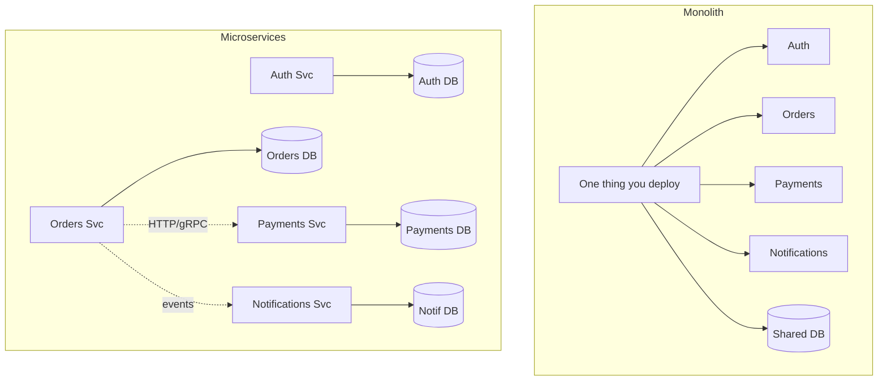
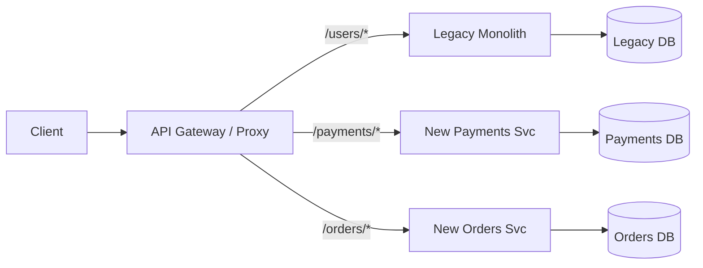
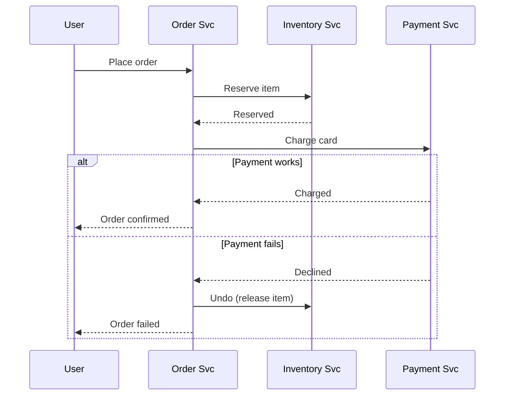
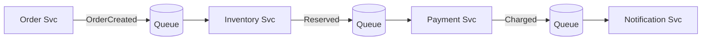
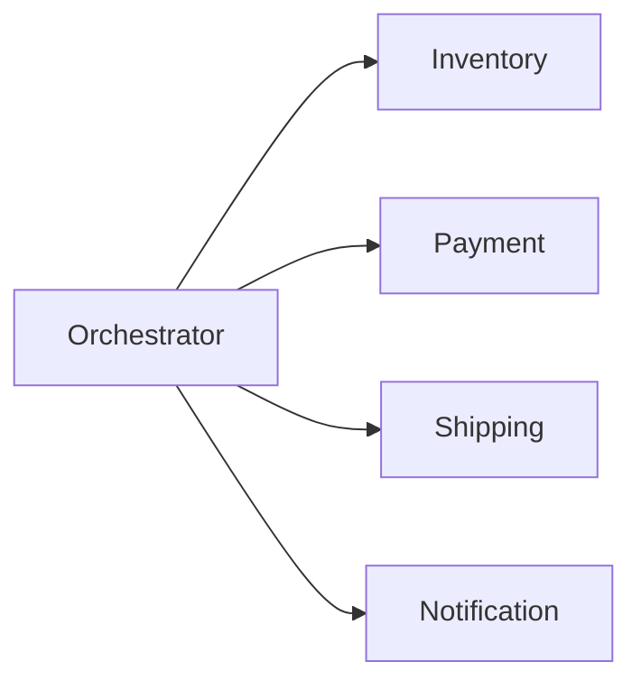
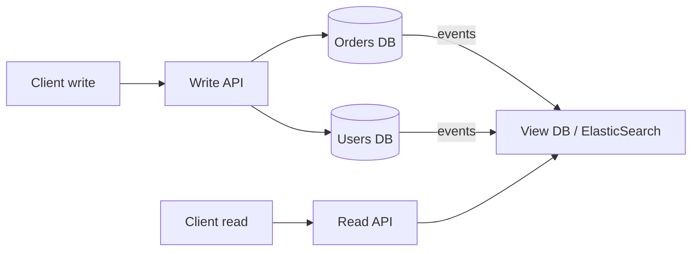

# Microservices & Patterns

> **TL;DR** — Microservices trade *simple code* for *big teams*. You lose easy joins, local transactions, and simple debugging. You gain the ability to ship, scale, and run each piece on its own. **Only take this trade when your team size and scale actually need it.**

## Key Takeaways

- **Microservices are about people first, tech second.** Conway's Law drives the split — your code ends up looking like your org chart.
- **Don't start with microservices.** A clean, well-organized monolith is easier, faster, and usually enough.
- Once you split, you take on hard distributed-system problems: **network delays, things half-failing, transactions, visibility into what's happening**.
- **The network is the new function call** — every call between services can fail, time out, or return junk.
- **A database per service is the biggest shift.** Sharing one DB kills most of the benefits.
- **SAGA** replaces ACID across services. **CQRS** replaces joins across services.

## Monolith vs Microservices

| Aspect              | Monolith                        | Microservices                         |
|---------------------|---------------------------------|---------------------------------------|
| Coupling            | Tight (direct function calls)   | Loose (network calls)                 |
| Scaling             | Whole app at once               | Scale each piece on its own           |
| Codebase            | One big repo                    | Many small focused repos              |
| Deploy              | All or nothing                  | Each service on its own               |
| CI/CD               | One pipeline                    | One per service                       |
| Speed               | Nanoseconds (in-process)        | Milliseconds (over the network)       |
| Debugging           | One stack trace shows it all    | Need distributed tracing              |
| Transactions        | Local ACID                      | Distributed → SAGA / 2PC              |
| Team setup          | Harder to split work            | One team per service (small teams)    |
| Failure             | Whole app goes down             | Some services keep going              |
| Tech choice         | One stack everywhere            | Each service can pick its own         |

### When microservices *don't* make sense

- Small team (under 10 engineers) — the overhead costs more than you gain.
- Early product where things change week to week.
- No good tooling for logging, metrics, or deploys.
- Strongly transactional work (bank ledger) — monoliths are better here.

### When they *do*

- Big engineering org where teams keep blocking each other on deploys.
- Different parts of the system have wildly different load or reliability needs (e.g. live search vs nightly reports).
- Different tech stacks actually make sense (ML in Python, API in Go, UI in TS).

## Phases of Microservice Design

### 1. Splitting up

How do you cut the monolith?

- **By business area** — what does the business do? Orders, Accounts, Payments, Billing.
- **By sub-area (Domain-Driven Design)** — find clear boundaries inside each area.
  - *Order management*: Placing, Tracking, Cancelling.
  - *Payment management*: Sending payment, Refund, Reconciliation.

**Rule of thumb:** a good service boundary is one where *most* changes only touch that one service.

### 2. Database plan

The hardest call. See the table below.

### 3. How services talk

| Style          | Tech            | When to use                                   |
|----------------|-----------------|-----------------------------------------------|
| Synchronous    | REST, gRPC      | Fast ask-and-answer. Easy to follow. |
| Asynchronous   | Kafka, RabbitMQ, SQS | Producer and consumer don't have to be up at the same time. OK with slow consumers. |
| Event-driven   | Pub/Sub, Kafka  | One event, many listeners; event sourcing.  |

**Rule of thumb:** prefer **async/events** for flows that cross domains. Use **sync** for user-facing reads.

### 4. Pulling it together

- **API Gateway** — one door for clients; handles auth, rate limits, and routing. Examples: Kong, AWS API Gateway, Envoy.
- **BFF (Backend for Frontend)** — one aggregation layer per client type (web BFF, mobile BFF).
- **Service Mesh** — a small proxy next to each service (Istio, Linkerd): handles mTLS, retries, and metrics.

### 5. Watching the system

**Three things to track:**
- **Logs** — what happened (ELK, Loki).
- **Metrics** — how much, how often (Prometheus, Datadog).
- **Traces** — the full path of a request across services (Jaeger, Zipkin, OpenTelemetry).

Without tracing, finding a bug that spans services is almost impossible.

### 6. Running and surviving

- **Containers + Kubernetes** — the default way to run services.
- **Circuit breakers** (Hystrix, Resilience4j) — stop calling a downstream that's failing.
- **Retries with backoff + jitter** — handle short-lived failures.
- **Bulkheads** — split resources so one failure can't drag down everything else.
- **Timeouts everywhere** — no request should hang forever.

## Key Design Patterns

### Strangler Fig Pattern

Slowly replace a monolith piece by piece. Named after fig trees that wrap around a host tree and eventually take its place.

1. Build a new service next to the monolith.
2. Send traffic for that feature to the new service via a gateway or proxy.
3. Once it's solid, delete the old code from the monolith.

**In the real world:** this is how Amazon, Netflix, and Shopify moved off their original monoliths over many years.

### Database per Service

| Plan                      | Good                                   | Bad                                     |
|---------------------------|----------------------------------------|------------------------------------------|
| Shared DB                 | Easy joins, local ACID                 | Hard to scale, schema changes hit everyone |
| DB per service (default)  | Scale each one, pick your tech, isolated | No joins (→ CQRS), no global ACID (→ SAGA) |

> "If two services share a database, they aren't really two services."

### SAGA — Transactions Without 2PC

A SAGA is a series of **small local transactions**, each with a **matching undo step**.

**Scenario:** placing an order needs to reserve stock, charge the card, and confirm the order — each in a different service.

**Two flavors:**

| Type           | How it works                                                                 | Good                         | Bad                                |
|----------------|------------------------------------------------------------------------------|------------------------------|-------------------------------------|
| Choreography   | Each service listens for events, does its step, publishes the next event.    | No single thing to break   | Hard to see the flow; risk of loops|
| Orchestration  | One controller runs the steps and calls each service in order.               | Easy to follow              | The controller can break; more code   |

**Choreography (event-driven):**

**Orchestration:**

**In the real world:** Uber (trip booking saga), Netflix (Conductor — their open-source orchestrator), Airbnb (reservation flow).

### CQRS — Split Writes and Reads

Split your model into two sides:

- **Write side** — handles changes (create, update, delete). Data lives in per-service databases.
- **Read side** — handles reads. A **view database** pulls together data from many services.

- The view DB stays in sync through event streams (Kafka), change-data-capture (Debezium), or DB triggers.
- Reads can use a totally different shape and engine (Elasticsearch for search, Redshift for analytics).

**Use when:**
- Your reads look very different from your writes.
- You need complex search or combining data across services.

**Don't use when:**
- Plain CRUD apps — the overhead isn't worth it.

**In the real world:** event-sourced banking systems, e-commerce search, Uber surge-pricing analytics.

## Other Patterns Worth Knowing

| Pattern            | Problem it solves                                         |
|--------------------|-----------------------------------------------------------|
| API Gateway        | Handles auth, rate limits, and pulling responses together |
| Service Discovery  | Lets services find each other (Consul, Eureka, K8s DNS)   |
| Circuit Breaker    | Stop calling a service that keeps failing                  |
| Bulkhead           | Split resource pools to contain failures               |
| Sidecar            | Same features in any language (logging, mTLS) |
| Event Sourcing     | Store events and build state from them — full history  |
| Outbox Pattern     | Safely publish events from a DB transaction            |

## Real-World Examples

| Company    | Approach                                                                  |
|------------|---------------------------------------------------------------------------|
| Netflix    | ~700 microservices, heavy use of circuit breakers (Hystrix), Conductor for orchestration |
| Uber       | Went from monolith to 2200+ services; now pulling back into "DOMAs" (domain-oriented groups) |
| Amazon     | Started the "two-pizza teams" idea; each team owns its service end-to-end        |
| Shopify    | Well-organized monolith → moved to cell-based setup for scale           |
| Monzo      | ~2000 Go microservices; heavy investment in tooling                       |

## Anti-Patterns

- **Distributed monolith** — services that must deploy together, share a DB, or can't run on their own. Worst of both worlds.
- **Nano-services** — services so tiny the overhead is bigger than the logic.
- **Shared libraries with business rules** — one change forces everyone to redeploy.
- **Long sync chains** — A calls B calls C calls D; delays and failures pile up.

## Interview-Ready Questions

1. *When would you pick a monolith over microservices?* → Small team, early product, no good tooling, strongly-transactional work.
2. *How do you handle a transaction across services?* → SAGA with undo steps. If you truly need ACID, don't split those services.
3. *How does the order service know when payment worked?* → Event (published to Kafka / SQS), or sync call with retries and idempotency.
4. *What's the hardest thing about microservices?* → Data. Eventual consistency, duplicated copies, and keeping views in sync.
5. *How do you debug a request that hits 15 services?* → Distributed tracing (one trace ID carried through every call).
