# Scaling from 0 to 1 Million Users

> **TL;DR** — Each scaling step exists because the last one broke. Walk through them in order — **don't add things you don't need yet**. Scaling too early is as costly as scaling too late.

## Key Takeaways

- **Start simple.** One server can handle more traffic than you'd think (thousands of QPS is doable).
- Each stage fixes a **specific bottleneck**: CPU, DB, location, traffic spikes.
- **Stateless app servers** are the trick that makes scaling out work. Keep session data in the DB or cache, not in memory on one box.
- **Caching gives the biggest boost** — but clearing the cache at the right time is one of the hardest problems in software.
- **Sharding is a last resort.** Once you shard, you lose joins across shards and ACID across shards.

## The Scaling Journey — overview

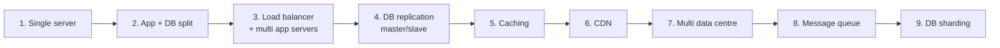

| Stage | Setup                          | New capacity   | What pushes you here                       |
|-------|---------------------------------------|---------------------|---------------------------------------|
| 1     | One server (app + DB)              | ~1K DAU             | Nothing — you just start here     |
| 2     | App and DB on separate boxes        | 10K DAU             | DB is eating the app's CPU/RAM             |
| 3     | LB + several app servers             | 100K DAU            | App tier can't keep up                    |
| 4     | Master-slave replication              | 500K DAU            | Reads overload the DB                 |
| 5     | Caching                               | 1M DAU              | Same DB reads happen over and over                |
| 6     | CDN                                   | Worldwide              | Static files eat bandwidth; users far away are slow |
| 7     | Multiple data centres                     | Global uptime           | Regional outages, latency targets    |
| 8     | Message queue                         | Handles spikes     | Async work, retries, fan-out         |
| 9     | Sharding                              | Huge write volumes    | One DB can't take the writes |

## Stage 1 — One Server

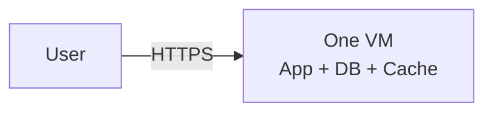

- Everything on one box.
- Fine until: you run out of CPU/RAM, or you need a backup.

## Stage 2 — App + DB on Separate Boxes (3-tier)

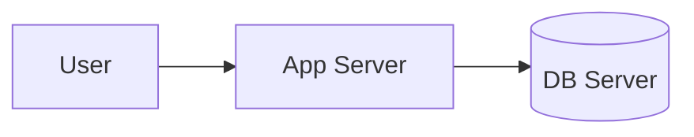

- App and DB now on different machines.
- Each can be sized for its own needs.
- **Why it helps:** DBs like fast disks, apps like fast CPU. They want different hardware.

## Stage 3 — Load Balancer + Many App Servers (4-tier)

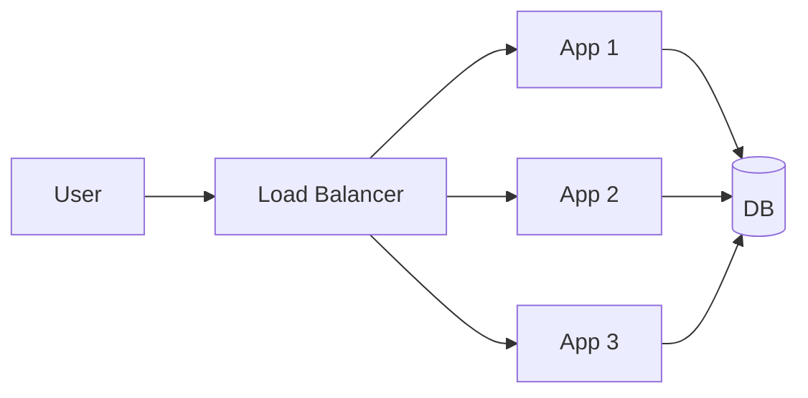

- **Scale out by adding boxes.**
- Common load balancers: AWS ELB/ALB, nginx, HAProxy, Envoy.
- **Ways to pick a server:** round-robin, least-connections, IP hash (sticky), weighted.
- **Safety win:** only the LB is on the public internet; the app servers sit on private IPs.
- **Must-have:** app servers have to be **stateless** (no in-memory session that only one box knows about).

### Where to keep session data

| Approach          | How                                        | Trade-off                |
|-------------------|--------------------------------------------|--------------------------|
| Sticky sessions   | LB pins a user to one server               | Breaks when that server dies  |
| Outside store     | Session in Redis / Memcached               | Extra network hop        |
| JWT tokens        | The user's cookie holds the session        | Hard to cancel early          |

## Stage 4 — DB Replication (Master-Slave)

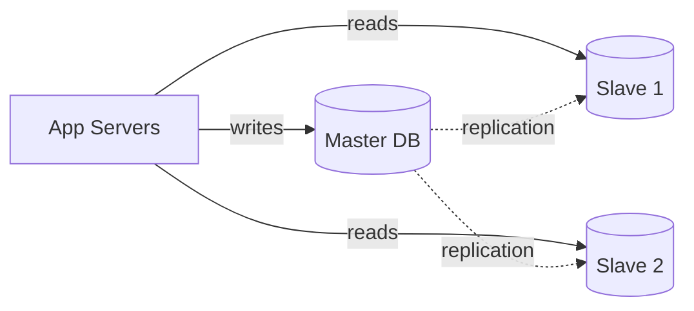

- **Writes** → master. **Reads** → slaves.
- Most workloads are **mostly reads** (80/20 or 90/10), so this scales reads cheaply.
- **Failover:** if the master dies, promote a slave (by hand or with tools like MHA, Orchestrator, AWS RDS).
- **Replication lag** is the gotcha: a user can write to the master and right after read old data from a slave.
  - Common fix: for that user, route reads to the master for a short time after a write.

## Stage 5 — Caching

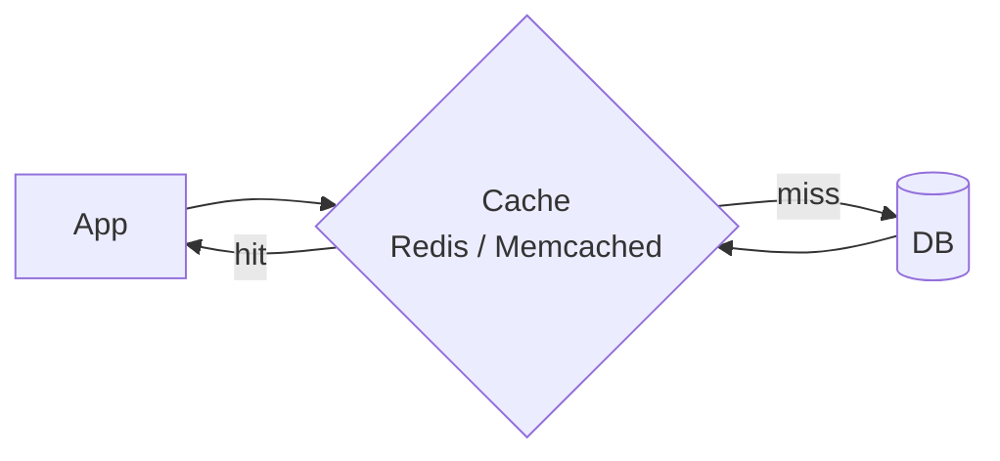

- Sits between app and DB.
- Common tools: **Redis** (richer features, can persist), **Memcached** (simpler, faster for plain key-value).
- **Hit rate** is the number that matters. Under 90% and you might be caching the wrong things.

### Caching approaches

| Approach        | How it works                                                                 |
|-----------------|--------------------------------------------------------------------------|
| Cache-aside     | App reads cache; on miss, reads DB and puts the value in the cache. Most common.     |
| Read-through    | The cache fetches from the DB on miss. App doesn't know the difference.                |
| Write-through   | Every write hits cache AND DB at the same time. Stronger consistency, slower writes. |
| Write-back      | Writes hit cache; DB is updated later. Fast, but you can lose data.      |
| Write-around    | Writes skip cache; go straight to DB. Good for data that's rarely read.       |

### How to evict old stuff

- **LRU** (Least Recently Used) — default, good for most cases.
- **LFU** (Least Frequently Used) — keeps popular keys.
- **TTL** (expire after N seconds) — simple, works well for time-bound data.

### Common pitfalls

- **Thundering herd** — a cache entry expires and N requests all hit the DB at once. Fix with request coalescing or a Redis lock.
- **Cold cache after deploy** — warm it up before serving real traffic.
- **Stale data** — write went to the DB but the cache still has the old value. Clear on write, or use short TTLs.

## Stage 6 — CDN (Content Delivery Network)

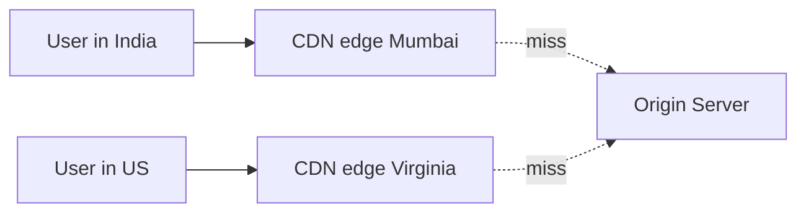

- Edge caches placed all over the world for **files that don't change much**: images, JS, CSS, videos, API responses with a TTL.
- **Hit at the edge → ~10ms delay.** Miss → goes back to the origin.
- **Also a DDoS shield:** takes the beating before it reaches your servers.
- **Providers:** Cloudflare, AWS CloudFront, Fastly, Akamai.
- **Push CDN vs Pull CDN:** push sends files up ahead of time; pull fetches them on first request. Pull is more common.

> Every CDN is a cache, but not every cache is a CDN.

## Stage 7 — Multiple Data Centres

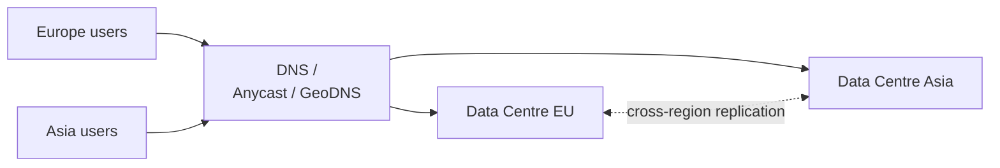

- Send users to the closest DC with **GeoDNS** or **Anycast**.
- Each DC copies data to the others (async most of the time, sync for critical data).
- **Active-active** = both DCs serve traffic. **Active-passive** = one works, one waits.
- Hardest parts:
  - Keeping data in sync across continents (physics: light only moves so fast).
  - Things with state, like sessions — either pin to one DC or copy them.

## Stage 8 — Message Queue

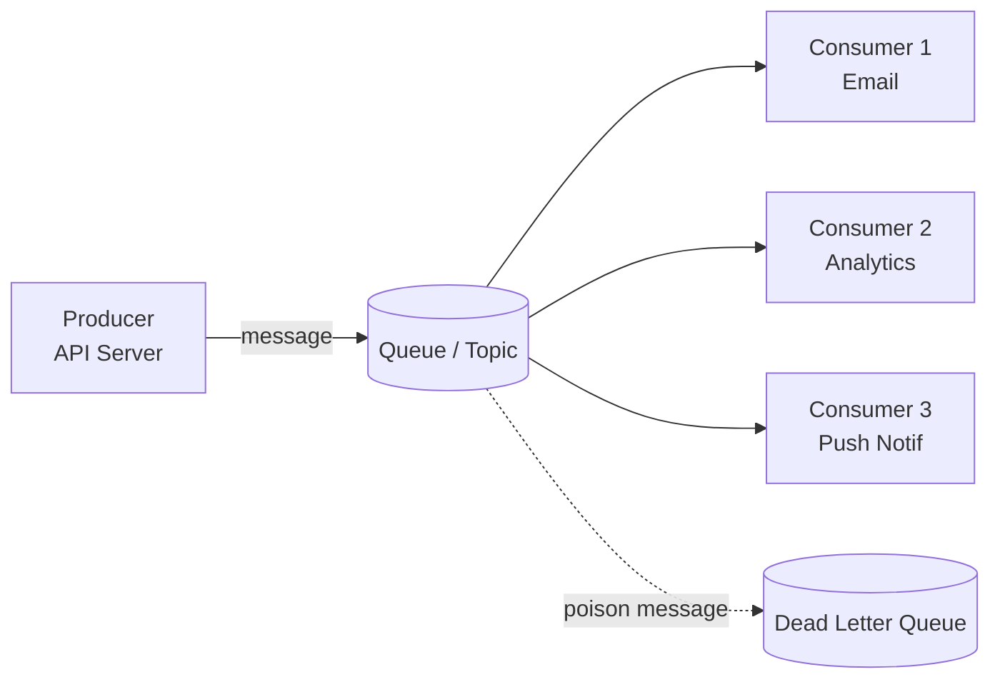

- **Why:** the producer doesn't have to wait for the consumer. Returns fast; the work happens in the background.
- **Used for:** emails, push notifications, batch jobs, analytics, order processing.
- **Kafka vs RabbitMQ vs SQS:**

| Tool       | Style              | Strong points                                | Good for                  |
|------------|--------------------|------------------------------------------|---------------------------|
| RabbitMQ   | Smart broker, simple consumer | Rich routing (topics, headers), acks | Task queues, RPC          |
| Kafka      | Simple broker, smart consumer | High throughput, stores a log, can replay      | Event streaming, analytics|
| AWS SQS    | Fully managed      | Simple, auto-scales                          | Plain decoupling         |
| Redis Streams | Built-in         | Very fast, but less durable         | Lightweight queues        |

- **DLQ (Dead Letter Queue)** — where "bad" messages go after failing a few times, so one bad message doesn't stall everything.

## Stage 9 — DB Sharding

When one master can't handle the **writes** any more, or the data doesn't fit on one box.

### Scale up first
- Bigger box: more CPU, more RAM, faster disk (NVMe).
- Easy, but has a ceiling — eventually you hit the biggest box AWS sells.

### Scale out — sharding

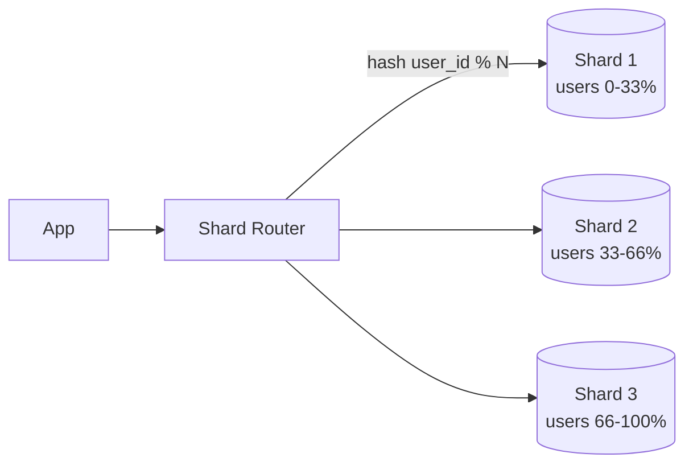

| Strategy             | What it does                                               | Watch out for                                      |
|----------------------|-----------------------------------------------------------|----------------------------------------------|
| Horizontal sharding  | Split rows across shards (users 1–1M, 1M–2M, …)           | Uneven load if keys aren't spread evenly    |
| Vertical sharding    | Split columns across shards (profile fields on one, activity on another) | Only gets you so far; still hot spots  |
| Geographic sharding  | Shard by region (EU users → EU shard)                     | Users who move regions                         |
| Directory-based      | A lookup table maps key → shard                             | The lookup service can become a bottleneck            |

### Sharding gotchas

- **Uneven load:** sharding by the first letter of a name → "S" and "A" shards overload, "X/Y/Z" sit idle.
- **Re-sharding is painful:** moving terabytes while still serving traffic.
- **Consistent hashing** fixes most of this — see [05-consistent-hashing.md](05-consistent-hashing.md).
- **No joins across shards:** duplicate data, or join in the app.
- **Global IDs:** primary keys must be unique everywhere — use UUID, Snowflake, or per-shard ranges.

## What the Full Setup Looks Like

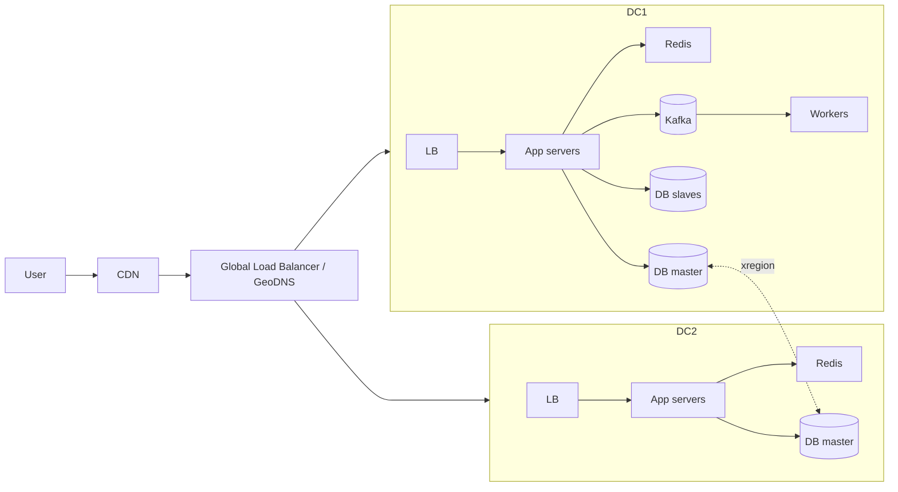

## Real-World Case Studies

| Company  | Key scaling moves                                                                 |
|----------|------------------------------------------------------------------------------------|
| Twitter  | Moved from Ruby monolith to JVM microservices; heavy Redis caching for timelines. Snowflake for IDs. |
| Instagram | Built on Postgres; sharded by user_id; used PGBouncer for connection pooling. Pre-build feeds. |
| Netflix  | All on AWS; practice chaos engineering to test failures; auto-scale each service. |
| Slack    | Went from PHP monolith to Vitess for MySQL sharding to handle big workspaces. |
| Pinterest | Sharded MySQL with custom routing; lots of caching; spread pins out in the background.     |

## Interview-Ready Questions

1. *Why not just scale up forever?* → You hit hardware limits, you have a single point of failure, and it costs a lot per unit.
2. *How do you handle replication lag?* → Read from the master for a user's recent writes, or watch the lag and route around it.
3. *How do you clear a cache correctly?* → TTL, write-through, clear on write, versioned keys.
4. *When do you shard?* → When one master can't keep up with writes, or the data is bigger than the biggest box.
5. *How do you re-shard without downtime?* → Double-write to new + old, backfill, flip reads, retire the old. Weeks of careful work.
