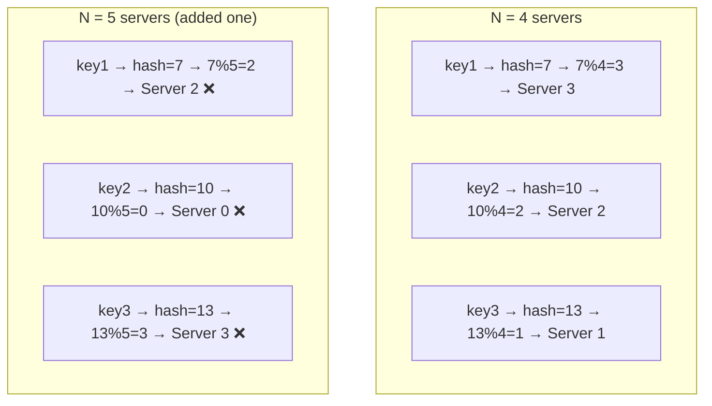
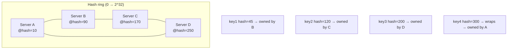
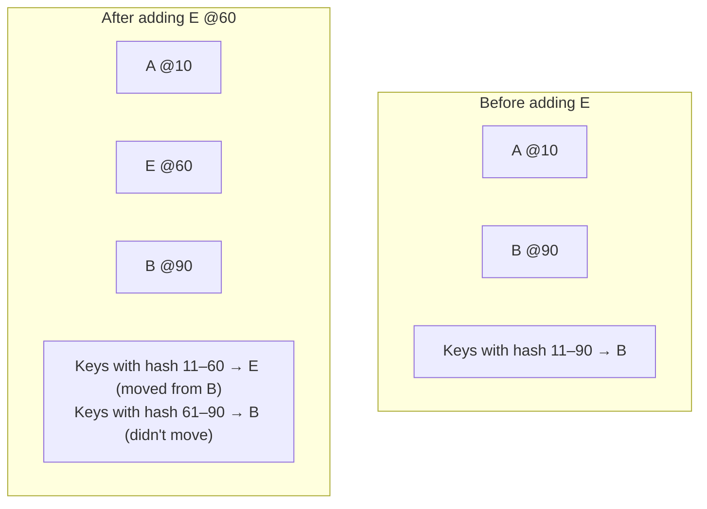
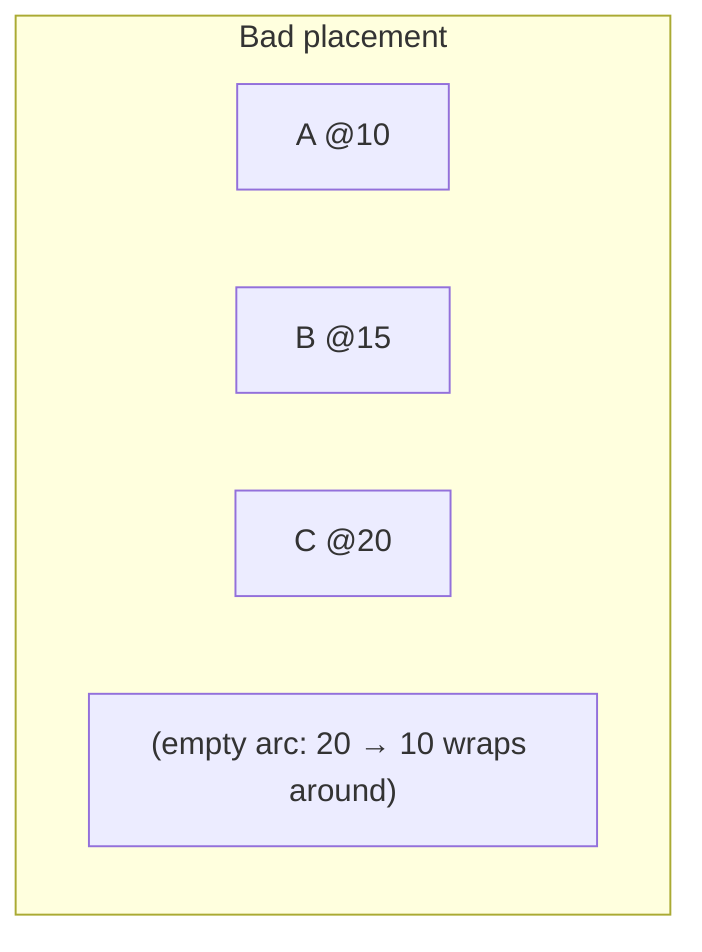
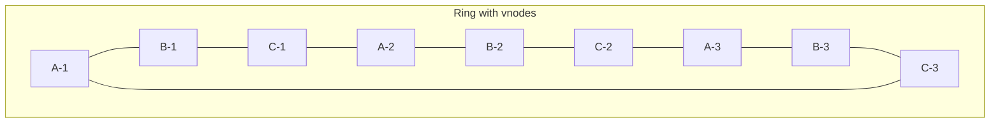

# Consistent Hashing

> **TL;DR** — Consistent hashing is a way to spread keys across N machines so that **adding or removing a machine only moves about 1/N of the keys** — not all of them. It's the backbone of Dynamo, Cassandra, Memcached clients, Akamai CDN, and almost every modern sharded data store.

## Key Takeaways

- **Plain mod-hashing breaks when you resize.** Adding one machine moves almost every key. Useless for clusters that grow.
- **Consistent hashing puts machines and keys on a ring.** Each key belongs to the next machine clockwise.
- **Adding or removing a machine only moves one machine's share of keys** — huge win when rebalancing.
- **A simple ring has uneven load** (some machines get clusters of keys). **Virtual nodes** fix this by placing each real machine at many spots on the ring.
- **Jump hash** is a newer option — uses less memory, no real ring.

## Hashing Basics

A hash function takes any input and gives back a fixed-size output. Used for fingerprinting, indexing, and spreading things out.

| Algorithm | Output size                  | Typical use                    |
|-----------|------------------------------|--------------------------------|
| MD5       | 128 bit / 32 hex chars       | Old; not for security          |
| SHA-1     | 160 bit / 40 hex chars       | Git commits (not safe for crypto anymore)|
| SHA-256   | 256 bit / 64 hex chars       | TLS certificates, blockchain   |
| SHA-512   | 512 bit / 128 hex chars      | High-security crypto           |
| MurmurHash3 | 128 bit                    | Fast, non-crypto; used in databases |
| xxHash    | 64–128 bit                   | Very fast fingerprinting       |

### What makes a good hash function
- **Same input, same output** every time.
- **Can't go backwards** — you can't figure out the input from the output (crypto hashes only).
- **Few clashes** — different inputs rarely give the same output; more bits means fewer clashes.
- **Avalanche** — flip one bit of input and about half the output bits flip.
- **Spreads evenly** — outputs are scattered across the whole range.

## Naive Approach — Mod Hashing

```
bucket_index = hash(key) % N
```

Works fine when `N` never changes. Watch what happens when it does:



Add one machine → **almost every key moves**. A disaster for caches (everything goes cold) and databases (massive rebalancing).

## Consistent Hashing — The Ring

**The idea:** put servers on a circle (0 to 2^32−1), and put keys on the same circle. Each key belongs to the **first server you hit going clockwise**.



### Adding a Server

Add server **E** at hash 60. Only keys between A (10) and E (60) move from B to E. Everything else stays put.



- Only about **1/N of keys** move.
- Nothing else is rebalanced.

### Removing a Server

If B goes down, its keys get picked up by the next clockwise server (C). Still only one server's worth of keys move.

## Problem — Uneven Spread

With just a few servers placed randomly, the ring can be **lopsided**: one server owns half the ring while another owns a tiny slice.



Server C now owns almost everything. Load is very uneven.

## Fix — Virtual Nodes (vnodes)

Each real server is placed at **many spots on the ring** (say 100–200 virtual positions per real server). Now keys land on each server evenly, on average.



### Why this helps
- Even load, without needing luck.
- When a server goes down, its ~200 slices get split across all other servers — the extra load is shared, not dumped on one neighbor.
- When a server comes back, it pulls ~200 small chunks from many peers at once — quicker to recover.

**Common setup:** 100–500 vnodes per real server in production.

## Code Sketch

```python
import hashlib, bisect

class ConsistentHash:
    def __init__(self, nodes=[], vnodes=150):
        self.vnodes = vnodes
        self.ring = {}          # hash -> real node
        self.sorted_hashes = [] # sorted list for binary search
        for n in nodes:
            self.add(n)

    def _hash(self, key):
        return int(hashlib.md5(key.encode()).hexdigest(), 16)

    def add(self, node):
        for i in range(self.vnodes):
            h = self._hash(f"{node}#{i}")
            self.ring[h] = node
            bisect.insort(self.sorted_hashes, h)

    def get(self, key):
        if not self.ring: return None
        h = self._hash(key)
        idx = bisect.bisect(self.sorted_hashes, h) % len(self.sorted_hashes)
        return self.ring[self.sorted_hashes[idx]]
```

## Where It's Used

| System             | How it uses consistent hashing                         |
|--------------------|--------------------------------------------------------|
| **Amazon Dynamo / DynamoDB** | Splits data across machines                  |
| **Apache Cassandra**| Splits data and places replicas (with vnodes)         |
| **Memcached clients (libketama)** | Spreads cache keys across the server pool |
| **Akamai CDN**     | Maps URLs to edge servers                              |
| **Riak**           | Places data                                            |
| **Discord**        | Routes messages across chat shards                     |
| **Nginx upstream hash** | Sticky session routing                            |
| **Google Chubby / ZooKeeper** (inside) | Leader-based key routing              |

## Alternatives

### Jump Consistent Hash (Google, 2014)
- A function: `jumpHash(key, N) → bucket`.
- No ring, no vnodes, O(log N) time, **tiny memory use**.
- But: buckets must be numbered 0 to N−1 (can't easily remove a specific server).

### Rendezvous Hashing (Highest Random Weight, HRW)
- For each key, compute `hash(key + node_id)` for every server; the key goes to the server with the highest score.
- Simpler than a ring, works well for small N.

## Things to Watch Out For

- **Don't hash with just the IP** — when a server restarts and keeps the same IP, you want the same keys back (good for cache warm-up).
- **Be careful with replica placement.** Just picking the next 2 clockwise servers for replicas is naive; production systems make sure replicas sit in **different failure zones** (rack, AZ, region).
- **Hot keys can still overload one server** even with a perfect spread. Fix: split hot keys further (e.g. `key#{0..9}`).
- **Don't use so few vnodes that the spread is lumpy** — 100+ is safe.

## Interview-Ready Questions

1. *Why not just use `hash(key) % N`?* → Resize moves almost every key.
2. *Why vnodes?* → Smooth out uneven load and rebalance evenly when servers join or leave.
3. *Can consistent hashing promise perfect balance?* → No — it's statistical. Vnodes tighten the spread but don't fix it.
4. *How do Cassandra and DynamoDB pick replica locations?* → "Next N clockwise" but aware of rack/AZ so replicas don't all sit in one failure zone.
5. *What happens to requests in flight when a server is added?* → Short window where some keys go to the wrong (old) server; systems either re-route after a miss or copy data over before the switch.
