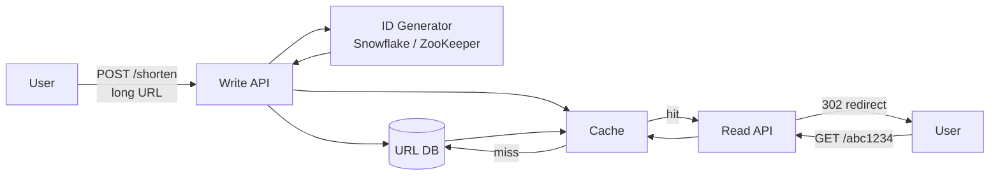
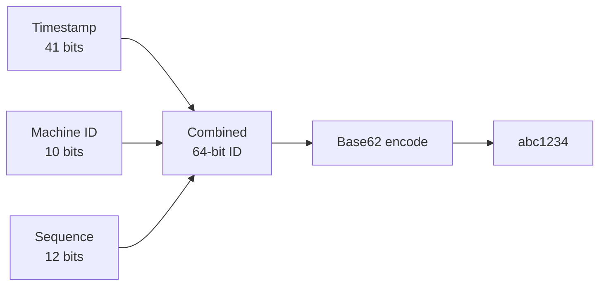
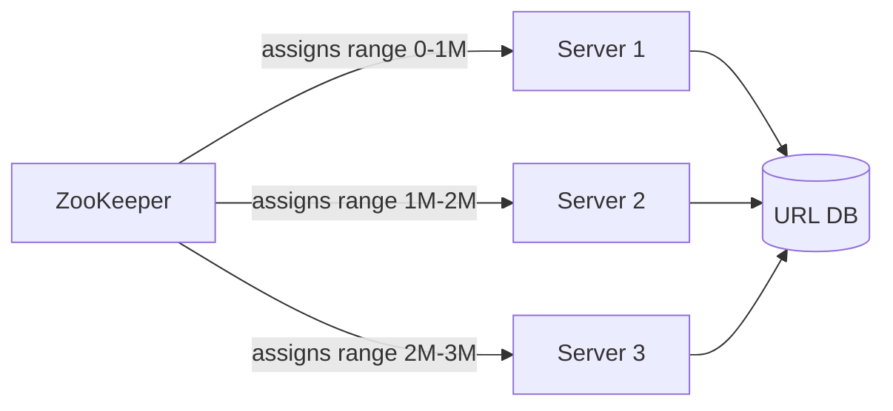
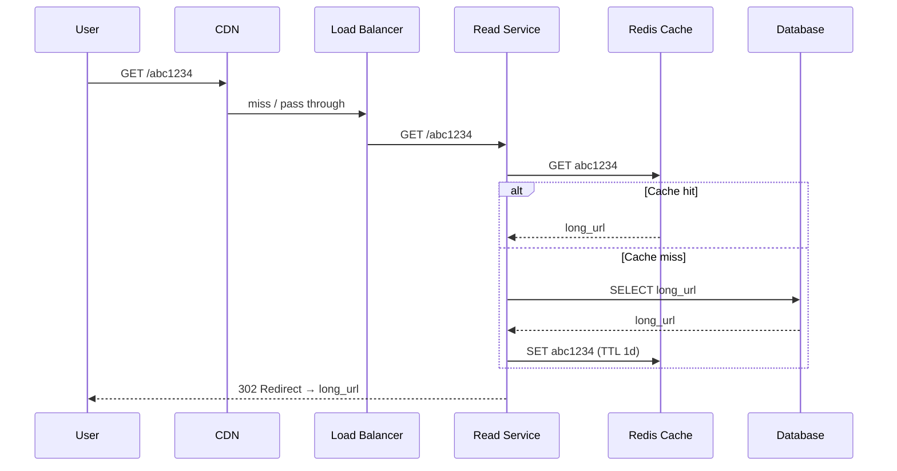
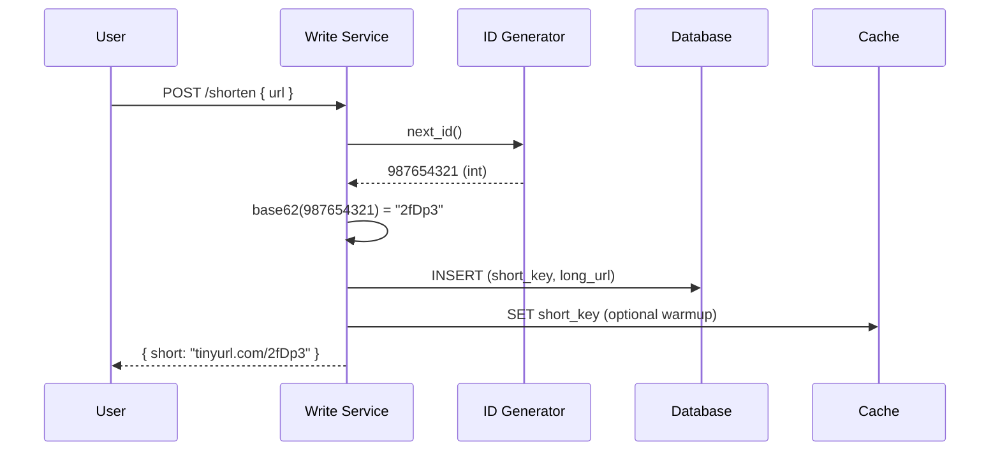
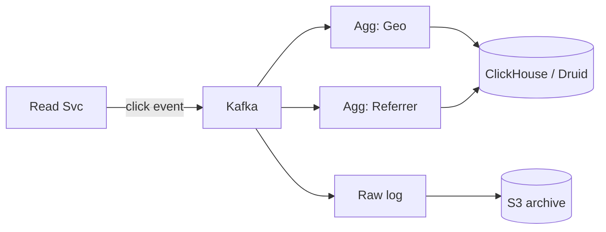

# Design: URL Shortener (bit.ly / tinyurl)

> **TL;DR** — Make a short, one-of-a-kind ID → turn it into Base62 → save the mapping. The interesting problems are **making IDs at scale**, **fast reads**, and **how the cache is laid out**.

## Key Takeaways

- **The hard part is making the ID.** It needs to be unique, not clash, short, and safe to create on many machines at once.
- **Base62 of numbers** is the standard way (0-9a-zA-Z = 62 chars).
- **Reads beat writes by a lot** (often 100 to 1). Build for heavy read caching.
- **Custom aliases + analytics** are the classic follow-up asks.
- **Snowflake** is the interview-friendly ID maker; **ZooKeeper ranges** are what production often uses.

## Step 1 — Requirements

### Functional
- Shorten a long URL → short URL (e.g. `https://tinyurl.com/abc1234`).
- Redirect short URL → long URL.
- Optional: custom alias (e.g. `/my-cool-link`).
- Optional: expiry.
- Optional: analytics (clicks, where it came from, location).

### Non-Functional
- Very fast redirects (< 100ms).
- High uptime — if shortening is down, we can recover; if redirects are down, users see 404s and lose trust.
- The short URL should be short (≤ 8 chars).
- URLs should not be guessable (no plain counting IDs).

## Step 2 — Rough Numbers

Guesses:
- 10M URLs / day → **3.65B / year → 365B over 100 years**.
- Reads to writes is **100:1** → 1B redirects per day → ~12K QPS.

### Short URL length

Alphabet = `[A-Z][a-z][0-9]` = **62 chars**.

| Length | How many IDs   |
|--------|------------------|
| 62⁵    | 916 M            |
| 62⁶    | 56 B             |
| 62⁷    | 3.5 T            |
| 62⁸    | 218 T            |

Pick **length 7 or 8** — plenty of room for 100 years.

### Storage
- Per record ≈ 500 B (URL + a few extras).
- 100 years of storage: `365B × 500B` ≈ **180 TB**.

## Step 3 — High-Level Design



## Step 4 — Making the ID (the hard part)

### Why not just hash the URL?
- MD5 → 32 hex chars. SHA1 → 40 hex chars. Too long.
- Cutting it to 7 chars means **clashes** at scale.
- **Same URL → same hash** means two users can't get two different short URLs for the same long URL (sometimes that's what you want, sometimes not).

### Option 1 — One counter in one DB
- One DB that counts up.
- ❌ Single place that can fail.
- ❌ Write bottleneck.
- ❌ Predictable IDs (a competitor can scrape your links).

### Option 2 — Snowflake (Twitter)

64-bit ID made of time + machine + sequence:

```
 0 | timestamp (41 bits)      | machine_id (10 bits) | sequence (12 bits)
^    ^                          ^                      ^
sign 69 years from epoch        1024 machines          4096 IDs/ms/machine
```

- **Distributed, no locks, roughly in time order.**
- Each machine can make up to 4096 IDs per millisecond without talking to the others.
- Turn the 64-bit number into Base62 → short URL.



**Used by:** Twitter (originally), Discord, Instagram (changed for shards).

### Option 3 — ZooKeeper Ranges



- A coordinator (ZooKeeper) gives each server a **separate range of IDs** (say 1M at a time).
- The server uses up its range, then asks for another.
- If a server dies, its unused range is **thrown away** (no big deal — we have 365B to spare).
- Pad if you need to: `"5"` → `"g======"` so all short URLs are the same length.

**Trade-off:** adds a ZooKeeper dependency; ranges waste a few IDs but that's nothing.

## Step 5 — Data Model

### URL Table (SQL — Postgres / MySQL)

```sql
CREATE TABLE urls (
    short_key    VARCHAR(8) PRIMARY KEY,
    long_url     TEXT NOT NULL,
    created_at   TIMESTAMP DEFAULT NOW(),
    expires_at   TIMESTAMP NULL,
    user_id      BIGINT,
    click_count  BIGINT DEFAULT 0
);
CREATE INDEX idx_urls_user ON urls(user_id);
```

### Or a Key-Value Store (DynamoDB, Cassandra)
- `short_key → { long_url, created_at, expires_at, ... }`
- A perfect fit: lookup is by exact key, no joins.

## Step 6 — Read Path (the 12K QPS path)

Most of your traffic is redirects. Tune this path.



- **80%+ cache hit rate** is easy — a few links get most of the traffic.
- **CDN caches the popular redirects at the edge** (big win — no LB or API involved).

## Step 7 — Write Path



## Step 8 — Extras

### Custom Aliases
- User asks for `/my-brand`.
- Check if it exists → 409 if taken.
- Keep custom keys in a separate pool or mark them so they don't clash with generated ones.

### Analytics
- Every redirect sends an event to Kafka.
- Consumers roll it up by location, source, and time into ClickHouse or BigQuery.



### Expiry
- Add `expires_at`; the read service checks it before redirecting.
- A periodic job (or TTL on a KV store) deletes expired entries.

### Abuse / Safety
- Scan the target URL against a phishing/malware blocklist (Google Safe Browsing API).
- Rate limit by IP or user.
- Require login for bulk creation.

## Scaling

- **Reads:** add more Redis replicas; push to CDN edge.
- **Writes:** many ID generator instances with different machine IDs (Snowflake); shard DB by `short_key` using consistent hashing.
- **DB shard key:** `short_key` — but short keys are short strings. Hash the short_key to pick a shard.

## Interview-Ready Questions

1. *Why Base62 and not Base64?* → Base64 has `+` and `/`, which aren't safe in URLs.
2. *Why not UUIDs?* → Too long (36 chars), not URL-friendly.
3. *How do you stop Snowflake ID clashes?* → Each generator has its own `machine_id`; on one machine, the counter keeps them unique.
4. *How to avoid hot shards?* → Hash the `short_key` — don't use raw prefixes (which cluster).
5. *What if the ID generator dies mid-range?* → With ZooKeeper, the leftover range is thrown away — no harm done.
6. *How to protect against bad URLs?* → Safe-browsing API check on creation, URL blocklist, per-user rate limit.
