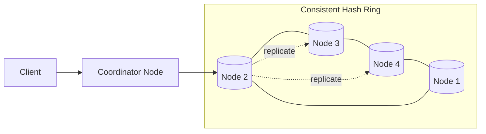
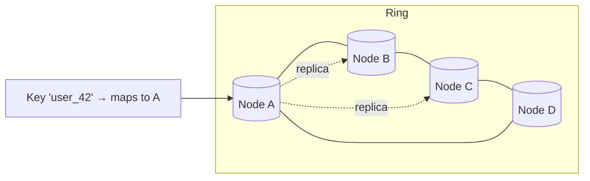
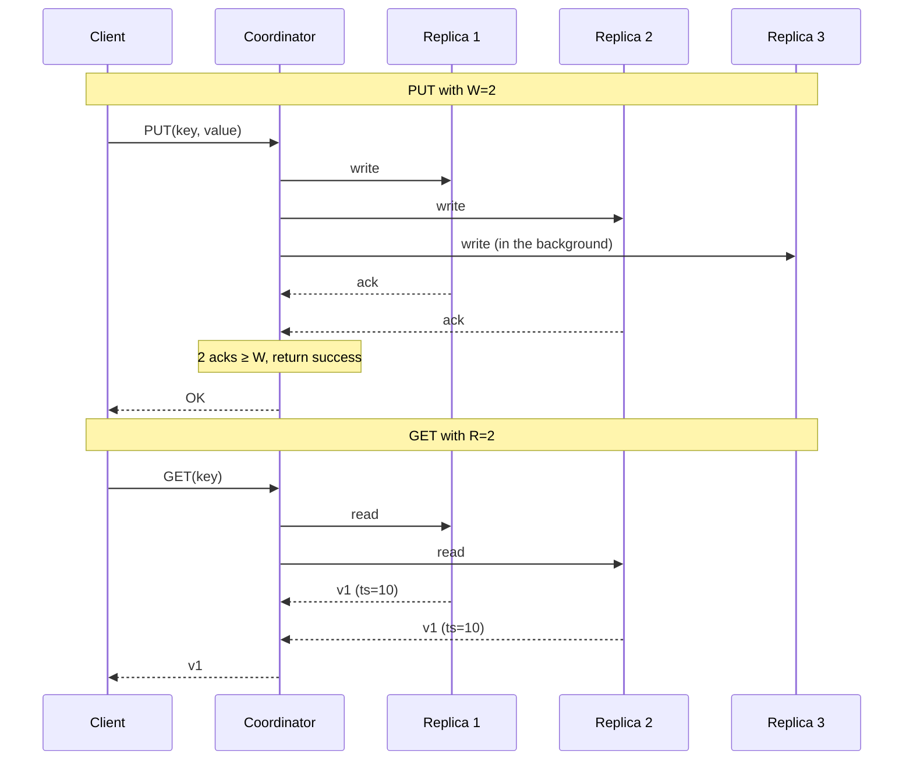
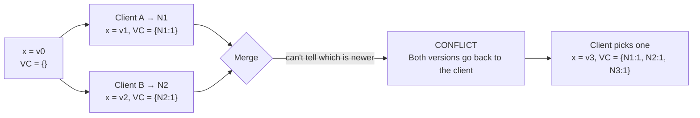
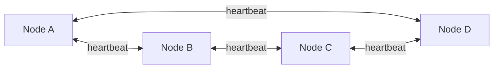
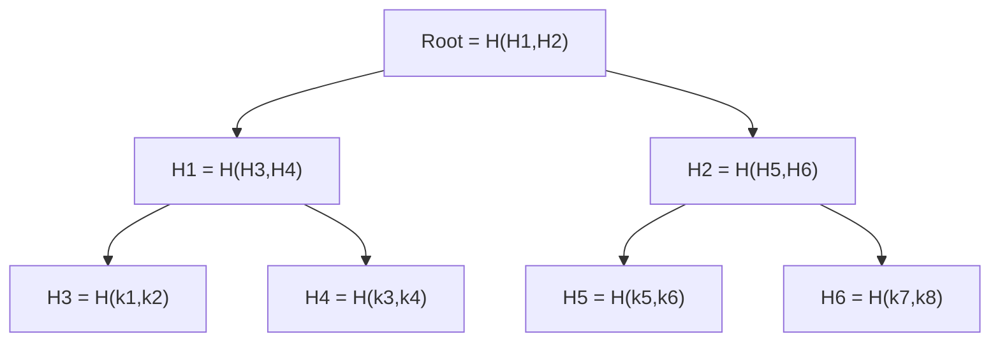
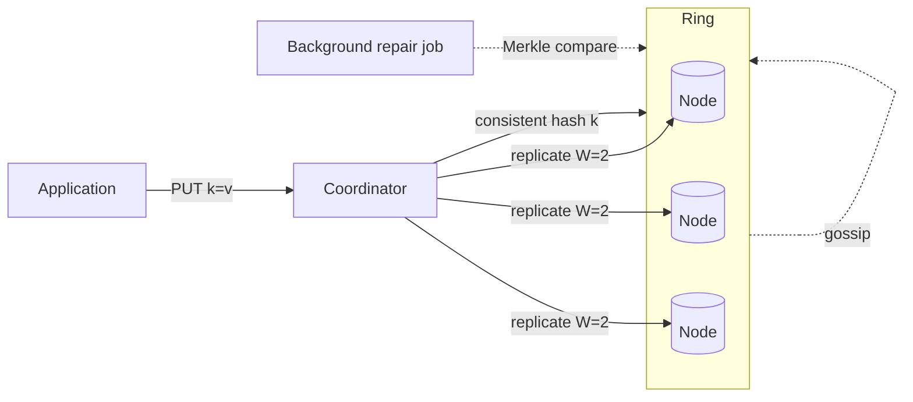

# Design: Key-Value Database (Dynamo / Cassandra)

> **TL;DR** — A distributed, no-leader, scale-out key-value store built on Amazon's 2007 Dynamo paper. Every node is equal. Data is **split** (by consistent hashing) and **copied** (to N neighbors). Reads and writes use **quorum** for tunable consistency. Replicas that drift apart are patched up using **vector clocks** and **Merkle trees**.

## Key Takeaways

- **Every node is equal.** No master — any node can take reads or writes.
- **Splitting data = consistent hashing** on the key.
- **Copying data = next N clockwise nodes** on the ring.
- **R + W > N** gives strong consistency. R + W ≤ N gives up C for speed and uptime.
- **Vector clocks** spot conflicting writes (but don't fix them) — the client fixes them.
- **Gossip** spreads cluster state without a central boss.
- **Merkle trees** find out-of-sync replicas in O(log n) without scanning everything.

## Design Goals
- **Scalable** — add a node, get more room, with almost no rebalancing.
- **No central boss** — no single point of failure or coordination.
- **Always-writable** (Dynamo's famous goal) — customers can always add to their cart.
- **Tunable consistency** — the app picks CP or AP per operation.

## Where It's Used

| System               | Built on Dynamo ideas                            |
|----------------------|--------------------------------------------------|
| Amazon DynamoDB      | Commercial follow-up to Dynamo                   |
| Apache Cassandra     | Open-source Dynamo ideas + Bigtable's data model |
| Riak                 | Closest public clone of Dynamo                   |
| ScyllaDB             | Cassandra rewritten in C++                       |
| Voldemort (LinkedIn) | Early open-source Dynamo-style store             |

**Classic use case:** Amazon's **shopping cart** — always writable, easy to fix conflicts (just take the union), eventual consistency is fine.

## Architecture at a Glance



## Design Steps

1. **Splitting** — decide which node owns each key.
2. **Copies / Durability** — survive losing a node.
3. **Get / Put protocol** — reads and writes with a quorum.
4. **Versioning the data** — catch concurrent writes.
5. **Gossip** — who's alive, who's not.
6. **Merkle trees** — background repair.

## 1. Splitting

- A plain hash map doesn't work across many machines — resize = remap.
- Use **consistent hashing** with vnodes — see [05-consistent-hashing.md](05-consistent-hashing.md).
- Each node owns a slice of the ring; keys land on the first clockwise node.

## 2. Durability & Copies

Any single node can die → copy each key to **N nodes** (usually `N = 3`).



- Copies = the next N−1 clockwise nodes after the owner.
- Each node keeps a **preference list** — the ordered servers that should hold each of its keys.
- Smart systems put copies in **different failure zones** (different racks / AZs).

## 3. Get & Put — the Quorum Protocol



### R + W + N Tunable Consistency

- `N` = how many copies.
- `W` = writes that must ack.
- `R` = reads needed for a response.

| Config          | Property                       | Trade-off                       |
|-----------------|--------------------------------|---------------------------------|
| `R + W > N`     | Strong consistency             | Slower; less uptime             |
| `R + W ≤ N`     | Eventual consistency           | Faster, more uptime             |
| Typical: N=3, W=2, R=2 | Majority quorum         | Balance of speed + correctness  |
| R=1, W=N        | Fast reads, slow writes        | Analytics-style                 |
| W=1, R=N        | Fast writes, slow reads        | Heavy write ingestion           |

**Why `R + W > N` gives strong consistency:** the write set and read set must **overlap** — so every read sees at least one node with the latest value.

### Read Repair & Hinted Handoff

- **Read repair** — if the coordinator sees replicas disagree on a read, it quietly fixes the stale ones.
- **Hinted handoff** — if a replica is down during a write, the coordinator stores the update somewhere else with a "hint" and sends it later when the replica is back.

### Load Balancer Variants

| Type               | Behavior                                                      | Latency |
|--------------------|---------------------------------------------------------------|---------|
| Plain LB           | Sends to any node; that node uses its preference list.        | Higher  |
| **Partition-aware**| Sends straight to the right owner (client knows the ring).    | Lower   |


Cassandra's driver is partition-aware by default.

## 4. Versioning — Vector Clocks

**Problem:** the coordinator dies mid-replication, or two clients write at the same time → replicas disagree.

**Fix:** tag each write with a **vector clock** = `{node → version}`.

```
Starting point: x = v0

Client A writes at Node 1:  x = v1,  VC = {N1: 1}
Client B writes at Node 2 at the same time:  x = v1', VC = {N2: 1}

Now the nodes sync — what's the 'current' value?

VC compare:
  {N1:1} vs {N2:1}  → neither is newer → CONFLICT
```



### Rules
- If `VC_a` is newer than `VC_b` (every counter ≥, at least one >) → keep `a`, drop `b`.
- Otherwise → **concurrent writes**, both go back to the client to sort out.

### Conflict resolution strategies
- **Last-Write-Wins (LWW)** — pick the one with the latest timestamp. Simple but lossy (clock skew can drop writes).
- **Client merge** — e.g. for a shopping cart, take the union of items. Keeps all writes.
- **CRDTs** — data types that merge themselves (counters, sets, maps). Used in Riak, Redis Enterprise.

## 5. Eventual Consistency

Dynamo-style systems pick **AP** from CAP.
- Clients see their own writes quickly.
- Replicas catch up within seconds.
- Some reads see slightly old data — usually fine.

## 6. Gossip — Who's Alive

Every node needs to know who else is up, without a central boss.



- Every second, each node picks a random peer and shares what it knows.
- **Spreads like a virus:** a change reaches the whole cluster in O(log N) rounds.
- **Failure detection:** if I haven't heard from X in T seconds, I mark it suspect; if several peers agree, it's marked down.
- Used by: Cassandra, Dynamo, Consul, Redis Cluster, SWIM-based systems (HashiCorp's Memberlist).

## 7. Merkle Trees — Background Repair

**Problem:** replicas quietly drift apart. How do you find differences without scanning the whole dataset?

**Fix:** build a **Merkle tree** of hashes over ranges of keys.



- Two replicas swap only **root hashes**. Same → done, replicas match.
- Different → go down **only the branch that's different**.
- Finds out-of-sync keys in **O(log N)** compares.

**Used by:**
- Cassandra for background repair
- DynamoDB inside
- Git (every commit is a Merkle root)
- Blockchains (Bitcoin, Ethereum)
- BitTorrent v2 (file chunking)

## Putting It All Together



## Trade-offs Summary

| Aspect         | Choice                                          |
|----------------|-------------------------------------------------|
| CAP            | AP (by default)                                 |
| Consistency    | Tunable with R/W                                |
| Joins          | None — bake access patterns into your keys      |
| Transactions   | Limited (single-partition only in Cassandra)    |
| Schema         | Flexible (no schema or wide-column)             |
| Operational    | Complex — repair, compaction, tombstones        |

## Interview-Ready Questions

1. *Why consistent hashing and not mod-hash?* → So adding a node only moves 1/N of keys.
2. *How do you get strong consistency in Cassandra?* → Use QUORUM reads and writes with `R+W > N`.
3. *What happens on a concurrent write to two nodes?* → Both versions survive (vector clock conflict), the client sorts it out on the next read.
4. *Why Merkle trees?* → Find drift in O(log n) — way cheaper than a full scan.
5. *Why gossip and not ZooKeeper?* → Dynamo philosophy — no central boss. Gossip is peer-to-peer, more uptime.
6. *What's a tombstone?* → A marker for a deleted key in eventual-consistency systems. Needed so the delete "wins" over older replicas that still have the value.
