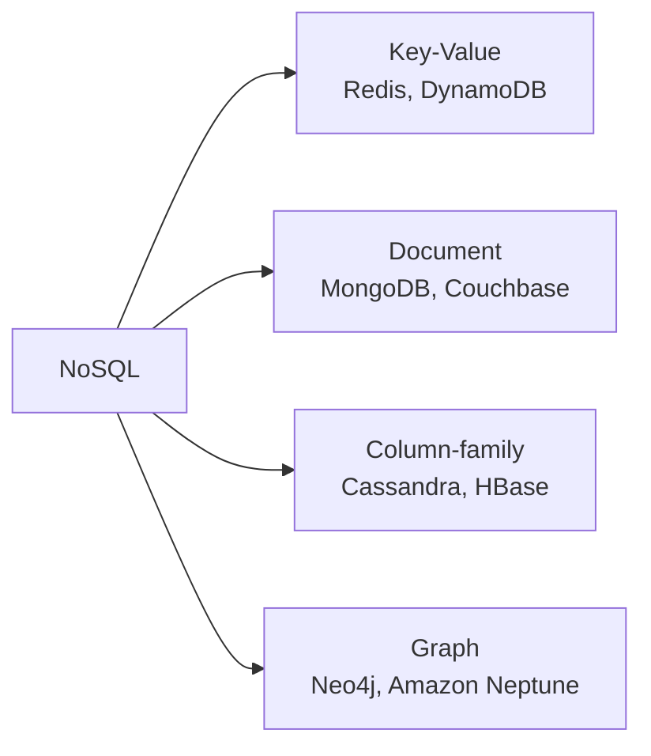
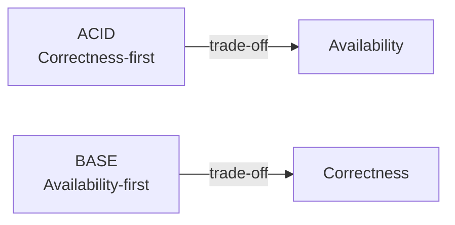
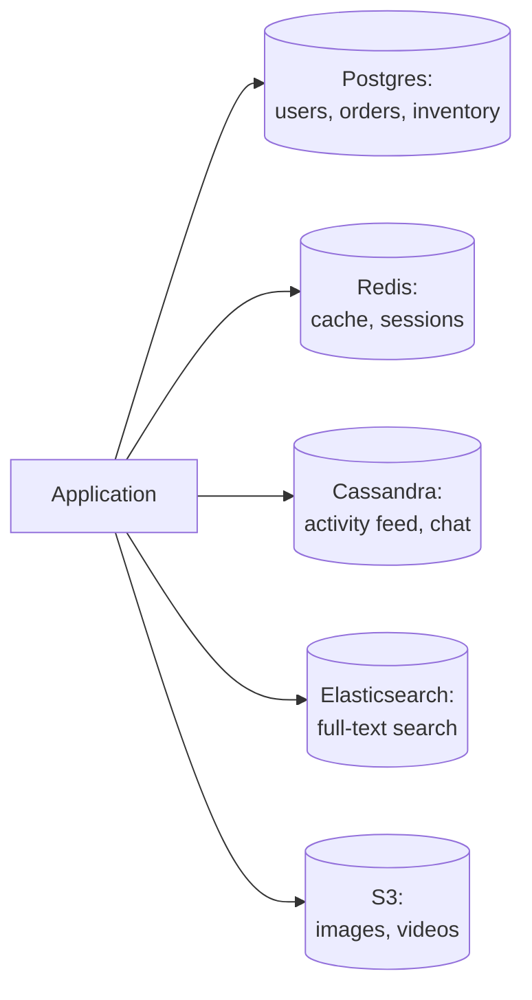

# SQL vs NoSQL

> **TL;DR** — SQL databases give you schemas, joins, and ACID — at the cost of vertical scaling limits. NoSQL databases scale horizontally and accept flexible data, at the cost of joins and transactions. The honest answer: modern systems **use both** — relational for money and identity, NoSQL for scale-out workloads.

## Key Takeaways

- **SQL isn't going anywhere.** Postgres scales further than people think.
- **"NoSQL" covers 4 very different families** (KV, document, column-family, graph). Know which one you mean.
- **ACID vs BASE** is a continuum — modern databases blur the line (e.g. DynamoDB transactions, Postgres JSONB).
- **Pick by access pattern, not hype.** If your queries need joins, use SQL. If your scale needs horizontal partitioning, consider NoSQL.
- **Denormalization** is the NoSQL equivalent of normalization — duplicate data to serve the query shape.

## Comparison at a Glance

| Aspect        | SQL                                        | NoSQL                                  |
|---------------|--------------------------------------------|----------------------------------------|
| Structure     | Predefined schema; relational tables       | Schema-less / flexible                 |
| Nature        | Centralized (one server per dataset)       | Decentralized / distributed            |
| Scalability   | Primarily vertical (horizontal is hard)    | Natively horizontal                    |
| Properties    | **ACID**                                   | **BASE**                               |
| Joins         | First-class                                | Usually none                           |
| Query power   | Rich (complex joins, aggregates)           | Simple key/field lookups               |
| Evolution     | Schema migrations                          | Document-per-record evolves freely     |
| Examples      | MySQL, PostgreSQL, SQL Server, Oracle      | DynamoDB, Cassandra, MongoDB, Redis    |

## NoSQL Types



| Type           | Example       | Model                                                      | When to use                  |
|----------------|---------------|------------------------------------------------------------|------------------------------|
| Key-Value      | Redis, DynamoDB | `key → value` (opaque blob)                              | Caching, sessions, shopping cart |
| Document       | MongoDB       | `key → JSON doc`; query on fields; secondary indexes      | Content, catalogs, flexible records |
| Column-family  | Cassandra     | `partition_key → { clustering_key → {col: val} }`; wide rows | Time series, messaging, high-write workloads |
| Graph          | Neo4j         | Nodes + edges with properties                              | Social networks, fraud, recommendations |

### Document Store — Example (MongoDB)

```json
{
    "_id": "user_42",
    "name": "Satyam",
    "email": "s@example.com",
    "addresses": [
        {"type": "home", "city": "Mumbai"},
        {"type": "work", "city": "Pune"}
    ]
}
```

- Entire record fits in one document — no joins needed.
- Schema varies per document.
- Secondary indexes on nested fields (`addresses.city`).

### Column-Family — Example (Cassandra)

```sql
CREATE TABLE user_messages (
    user_id TEXT,              -- Partition key
    sent_at TIMESTAMP,          -- Clustering key
    msg_id UUID,
    body TEXT,
    PRIMARY KEY (user_id, sent_at)
) WITH CLUSTERING ORDER BY (sent_at DESC);
```

- All rows for one `user_id` live on the same node — reading a user's messages = single disk hit.
- Different rows can have different columns.
- Scales linearly as you add nodes.

### Graph — Example (Neo4j / Cypher)

```cypher
MATCH (alice:User {name: "Alice"})-[:FRIEND]->(f)-[:FRIEND]->(fof)
WHERE NOT (alice)-[:FRIEND]->(fof)
RETURN fof.name
```

- Traversals are O(1) per edge — no join cost.
- Perfect for "friends of friends", fraud rings, recommendation graphs.

## ACID vs BASE

### ACID (SQL / traditional)
- **A**tomicity — all or nothing within a transaction.
- **C**onsistency — data integrity / constraints preserved.
- **I**solation — concurrent transactions don't interfere.
- **D**urability — committed data survives crashes.

### BASE (NoSQL / distributed)
- **B**asically **A**vailable — always responsive (due to replication).
- **S**oft state — state may drift momentarily across replicas.
- **E**ventual consistency — replicas converge given time.



## When to Use Which

### Use SQL when:
- You need **complex queries** or **joins**.
- Data is **relational** (orders ↔ items ↔ customers).
- You need **strong consistency / transactions** (banking, inventory).
- Scale is **moderate** (millions to low billions of rows on one box).

### Use NoSQL when:
- **Access patterns are known and simple** (lookup by key).
- **Data volume is huge** and requires native horizontal scaling.
- **Eventual consistency** is acceptable (social feed, catalog).
- Schema is **highly variable** across records.

> **Rule of thumb:**
> - Need ACID → SQL.
> - Massive scale with simple access → NoSQL.
> - Doing both? Use them together (polyglot persistence).

### Polyglot Persistence (real world)



**Who actually does this:** Uber, Netflix, Airbnb — all use Postgres + Cassandra + Redis + a search engine + object storage.

## NoSQL Keys — Modelled for Access

| Key Type              | Purpose |
|-----------------------|---------|
| **Primary Key**       | Uniquely identifies a record |
| — Surrogate Key       | System-generated (UUID, Snowflake) |
| — Natural Key         | Business value (email, ISBN) |
| **Shard / Partition Key** | Distributes data across shards; each shard should be self-sufficient |
| **Clustering Key**    | Sort order within a partition (`userid#dob#orderid`) |
| **Composite Key**     | Multiple fields combined (partition + clustering) |
| **Foreign Key**       | Rare in NoSQL; enforce at app level |
| **Secondary Index**   | Query on non-primary fields (e.g. MongoDB, DynamoDB GSI) |

### Designing Keys — Cassandra Example

Want to query: "all messages user X sent in last 7 days, ordered by time."

```sql
PRIMARY KEY (user_id, sent_at)
```

- Partition key = `user_id` → all of X's messages on one node.
- Clustering key = `sent_at` → already sorted.
- Read = single disk seek + range scan.

> **The query shape drives the schema in NoSQL.** Opposite of SQL, where the schema drives queries.

## SQL Concurrency Control

### Strategies
- **Database-level locks** — pessimistic or optimistic.
- **Distributed locks** — Redis Redlock, ZooKeeper locks.
- **Atomic operations** — single-statement updates (`UPDATE ... WHERE version = ?`).
- **Two-Phase Commit (2PC)** — for cross-service transactions; blocking and slow.
- **Eventual consistency with retries** — when strict consistency isn't required.

### Optimistic vs Pessimistic Locking

```mermaid
sequenceDiagram
    participant T1
    participant T2
    participant DB
    rect rgb(230,245,255)
    Note over T1,DB: Pessimistic (SELECT FOR UPDATE)
    T1->>DB: SELECT * WHERE id=1 FOR UPDATE
    DB-->>T1: locked
    T2->>DB: SELECT * WHERE id=1 FOR UPDATE
    Note right of DB: T2 waits...
    T1->>DB: UPDATE; COMMIT
    DB-->>T2: lock released
    end
    rect rgb(255,245,230)
    Note over T1,DB: Optimistic (version column)
    T1->>DB: SELECT id, version=5
    T2->>DB: SELECT id, version=5
    T1->>DB: UPDATE WHERE version=5
    DB-->>T1: OK (version=6)
    T2->>DB: UPDATE WHERE version=5
    DB-->>T2: 0 rows — retry!
    end
```

| Strategy     | Use when                                           |
|--------------|----------------------------------------------------|
| Optimistic   | Low contention (most writes succeed). Web apps.    |
| Pessimistic  | High contention (many writers fighting). Inventory counters, seat reservations. |

## SQL Isolation Levels (Postgres / MySQL)

| Level              | Dirty reads | Non-repeatable reads | Phantom reads |
|--------------------|-------------|----------------------|---------------|
| Read Uncommitted   | ✅ possible | ✅ possible          | ✅ possible   |
| Read Committed     | ❌          | ✅ possible          | ✅ possible   |
| Repeatable Read    | ❌          | ❌                   | ✅ possible*  |
| Serializable       | ❌          | ❌                   | ❌            |

*Postgres' "Repeatable Read" actually prevents phantoms via snapshot isolation.*

## SQL Index Types

```sql
-- B-tree (default; good for range queries)
CREATE INDEX idx_name ON table(column_name);

-- Hash (exact-match only; faster than B-tree for equality)
CREATE INDEX idx_name ON table USING hash (column_name);

-- Expression (index a computed value)
CREATE INDEX idx_lower_name ON users ((lower(email)));

-- Partial (only a subset of rows)
CREATE INDEX idx_active ON users (id) WHERE active = true;

-- GIN — good for arrays, JSONB, full-text
CREATE INDEX idx_tags ON posts USING gin (tags);

-- BRIN — block-range index, tiny, for time-ordered data
CREATE INDEX idx_created ON events USING brin (created_at);
```

**Rule:** every index speeds reads but slows writes and costs disk. Index what you query, nothing more.

## Transactions in NoSQL

Historically limited. Modern NoSQL has been adding transactions:

| System        | Transaction support                                         |
|---------------|-------------------------------------------------------------|
| DynamoDB      | `TransactWriteItems` (up to 100 items) across tables        |
| MongoDB       | Multi-document transactions within a replica set or sharded cluster |
| Cassandra     | Lightweight transactions (Paxos-backed compare-and-set, single partition) |
| Redis         | MULTI/EXEC (not true ACID; no rollback)                     |

## NewSQL — Best of Both?

Modern systems that claim "SQL API + horizontal scale":

| System                | Approach                                            |
|-----------------------|-----------------------------------------------------|
| Google Spanner        | TrueTime for globally consistent transactions       |
| CockroachDB           | Open-source Spanner-inspired                        |
| TiDB                  | MySQL-compatible, distributed                       |
| YugabyteDB            | PostgreSQL-compatible, distributed                  |
| Vitess (Slack, YouTube)| Sharded MySQL with a SQL layer                     |

**Trade-off:** latency hit for global consistency (Spanner's wait-out-of-clock-uncertainty).

## Interview-Ready Questions

1. *"We need a database. Which one?"* → Ask about: access patterns, read:write ratio, scale, consistency needs, schema stability. Only then decide.
2. *Can you do joins in NoSQL?* → Usually no. Either denormalize (duplicate data), do it in the app layer, or use a graph DB.
3. *When would Postgres + JSONB beat MongoDB?* → Most of the time for small-to-medium workloads. JSONB gives you flexible fields AND SQL joins AND transactions.
4. *ACID vs BASE — can you have both?* → NewSQL systems (Spanner, Cockroach) try. You pay with latency.
5. *How does Cassandra handle schema changes?* → Add columns anytime; old rows just don't have them. Removing is harder (tombstones).
