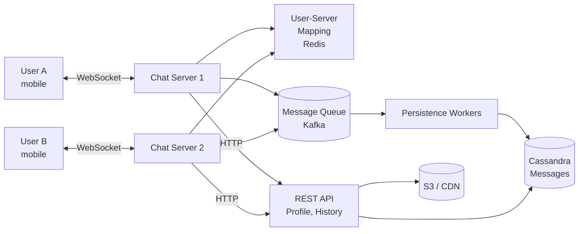
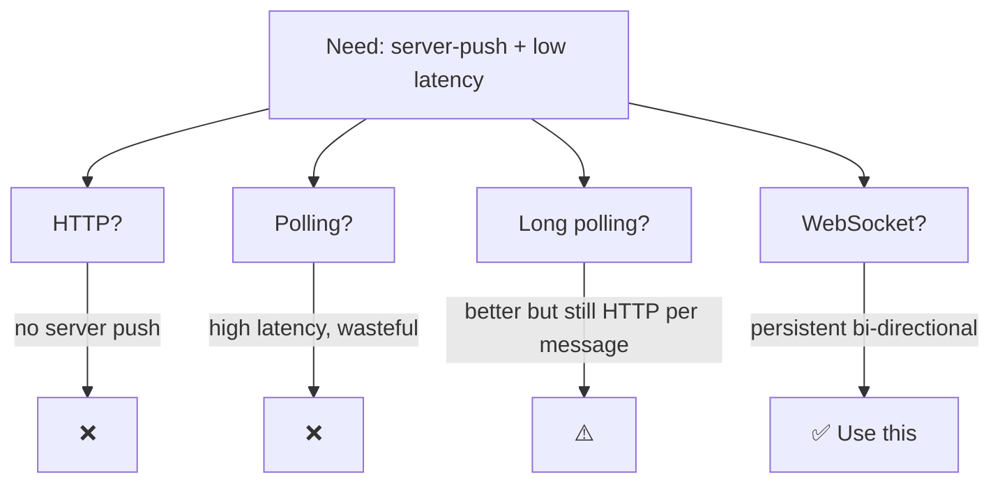
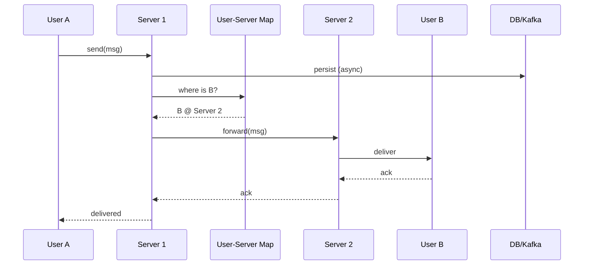
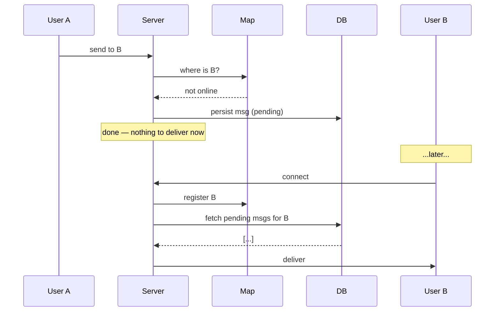
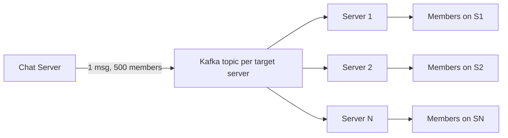
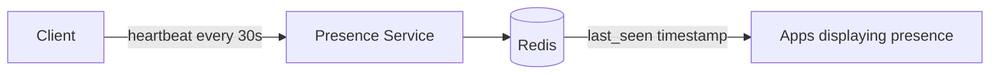

# Design: Chat Application (WhatsApp / Messenger)

> **TL;DR** — The core problems are **real-time delivery**, **presence**, **offline storage**, and **group fan-out** at massive scale. WebSockets for live messaging, Cassandra for history, a user-to-server mapping service to route across servers, and an event-driven fan-out for groups.

## Key Takeaways

- **WebSockets** are the right transport for the live path; HTTP for everything else.
- **User-to-server mapping** is the linchpin — lets Server A send to a user connected to Server B.
- **Column-family NoSQL** (Cassandra) is the canonical choice for chat history: massive writes, range reads per conversation, no joins.
- **Groups are a fan-out problem.** For big groups, use a dedicated group service + queue-based fan-out.
- **Offline delivery** must be persisted; deliver on reconnect via queued messages.
- **End-to-end encryption** (Signal Protocol) adds a significant but important layer of complexity.

## Requirements

### Functional
- **1-to-1 messaging** (text initially; later images/video/voice notes).
- **Group messaging** (up to ~500 members for most products; WhatsApp: 1024).
- **Delivery receipts** (sent / delivered / read).
- **Last-seen / online presence.**
- **Message history** persists & is searchable.
- **Login / authentication.**

### Non-Functional
- **Scalable** — 2B users, 50M DAU.
- **Available** — 99.99% uptime; degrading gracefully on partial outage.
- **Low latency** — message delivery < 500ms globally.
- **Durable** — no message lost once "sent" is confirmed.

## Capacity Estimation

| Metric                 | Value                        |
|------------------------|------------------------------|
| Total users            | 2B                           |
| DAU                    | 50M                          |
| Msgs / user / day      | 10 msgs × 4 recipients = 40  |
| Total messages / day   | 2B                           |
| Avg msg size           | 100 B                        |
| Storage / day          | 200 GB                       |
| 10-yr retention        | ~730 TB                      |
| Peak concurrent WS     | ~10M connections             |
| Memory per WS          | ~10 KB → 100 GB total across fleet |

## High-Level Architecture



## Why Not Peer-to-Peer?

Tempting idea, fatal flaws:
- ❌ Not scalable for group chat (N² connections).
- ❌ Can't deliver to offline recipients.
- ❌ No central history / search.
- ❌ No presence without a central authority.

→ **Client-server** is the norm. P2P only for ephemeral video calls (see [12-zoom.md](12-zoom.md)).

## Protocol Choice



| Option        | Verdict                                                                 |
|---------------|-------------------------------------------------------------------------|
| HTTP          | One-way (client → server). Fine for sending but not receiving.          |
| Polling       | Wasteful; high latency.                                                 |
| Long polling  | Better; still HTTP overhead per cycle.                                  |
| **WebSocket** | Persistent bidirectional. **Use for chat.** HTTP for everything else.  |

## Cross-Server Messaging

User A on Server 1 sends a message to User B on Server 2.



### User-to-Server Mapping
- Redis: `user_id → (server_id, last_heartbeat)`.
- Server A, on connection, writes its mapping; removes on disconnect.
- TTL-based (auto-expire on crash).
- Sharded Redis if hot — but user distribution is even so rarely an issue.

### Alternative: Pub/Sub Routing
- Every chat server subscribes to its own Redis channel / Kafka topic.
- Server 1 publishes to `user:B_server_channel` without needing to know Server 2 directly.

## Database Design

### Requirements driving the choice
- Heavy reads (history, user/group lookup).
- Heavy writes (msg ingest).
- No complex joins.
- Very long histories (years).
- Range queries on time.
- Low-latency search.

→ **Column-family NoSQL** (Cassandra). Native support for wide rows, clustering, linear scale.

### Schema — Messages

```sql
CREATE TABLE messages (
    conversation_id TEXT,        -- Partition key
    sent_at TIMESTAMP,           -- Clustering key (sort order)
    message_id UUID,
    sender_id TEXT,
    body TEXT,
    delivery_status TEXT,
    PRIMARY KEY (conversation_id, sent_at, message_id)
) WITH CLUSTERING ORDER BY (sent_at DESC);
```

### Conversation ID — deterministic for 1:1

For 1:1 chats, both endpoints need the same `conversation_id` regardless of who initiates.

```python
def conversation_id(user_a, user_b):
    low, high = sorted([user_a, user_b])
    return hash(f"{low}:{high}")
```

### Why no SQL joins?
- All messages of a conversation live together on one partition.
- Loading a chat = single partition scan.
- Pagination = `WHERE conversation_id = ? AND sent_at < ? LIMIT 50`.

## Offline Messages



- Persist every message **before** attempting delivery.
- On reconnect, fetch undelivered messages ordered by time.
- After delivery confirmation, mark as delivered (not always needed — presence of ack is enough).

## Groups

### Schema

```sql
CREATE TABLE group_messages (
    group_id TEXT,               -- Partition key
    sent_at TIMESTAMP,           -- Clustering key
    message_id UUID,
    sender_id TEXT,
    body TEXT,
    PRIMARY KEY (group_id, sent_at, message_id)
);

CREATE TABLE group_members (
    group_id TEXT,
    user_id TEXT,
    joined_at TIMESTAMP,
    role TEXT,  -- admin/member
    PRIMARY KEY (group_id, user_id)
);
```

### Fan-out strategies

| Strategy           | How it works                                                     | When to use        |
|--------------------|------------------------------------------------------------------|--------------------|
| Fan-out on write   | Copy message into each recipient's inbox at send time            | Small groups       |
| Fan-out on read    | Store once; recipient queries group on open                      | Very large groups  |
| Hybrid             | Fan-out on write for small groups, on-read for mega-groups      | Most production     |

### Flow
1. Message hits Chat Server.
2. Server looks up group members.
3. For each member — look up their server from mapping service.
4. Forward via direct RPC or a Kafka topic per server (more scalable).



## Last Seen / Presence



- Client sends heartbeat every ~30s.
- Presence service stores `user_id → last_seen_ts` in Redis.
- If no heartbeat for threshold (e.g. 60s) → offline.
- **Privacy options:** "online", "last seen", or "hidden".

## Delivery Receipts

- **Sent** — server ACK to sender.
- **Delivered** — recipient's device received it.
- **Read** — recipient opened the chat.

Each is a small message back to the sender. Heavy — typically batched for groups.

## Media Handling

- Don't route binary through the chat protocol.
- Client uploads blob to S3 (or similar) via signed URL.
- Send chat message with `media_url`.
- Recipient downloads from CDN.

## End-to-End Encryption (E2EE)

Used by WhatsApp, Signal, iMessage. Based on the **Signal Protocol**.

- Keys generated on-device.
- Server relays ciphertext; can't read content.
- **Double Ratchet** — fresh key per message for forward secrecy.
- Complicates everything: backups, search, multi-device.

## Scaling Details

- **WebSocket servers** — horizontally scalable; a single machine can handle ~100K connections.
- **Sticky routing** — reconnect to same server when possible for cache locality; otherwise map service re-registers.
- **Kafka** for the ingest pipeline — decouples servers from DB writes.
- **Cassandra** — sharded by `conversation_id`; add nodes for linear scale.

## Real-World Notes

- **WhatsApp** famously ran on a small team (~55 engineers for 900M users in 2015) with an Erlang backend tuned for concurrency.
- **Slack** uses WebSockets + a complex sharding scheme by workspace.
- **Discord** moved message storage from Cassandra to ScyllaDB for performance.

## Interview-Ready Questions

1. *Why WebSockets over long polling?* → Lower latency, less overhead, persistent full-duplex.
2. *What happens when a chat server crashes mid-connection?* → Client reconnects (to same or different server); server reads undelivered from DB.
3. *How do you handle a 1000-member group?* → Fan-out via a queue; avoid sync loops. Possibly fan-out-on-read for huge groups.
4. *How do you ensure no message is lost?* → Persist before delivering; at-least-once delivery with idempotent client handling.
5. *Why Cassandra over MongoDB for messages?* → Write-optimized, wide rows, linear scale, clustering order maps to chat access pattern.
6. *Read receipts cost a lot — how do you handle them?* → Batch per user, or sample ("A, B, and 8 others read this").
