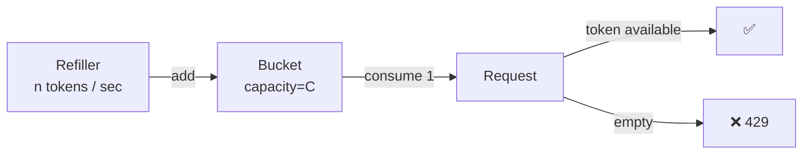
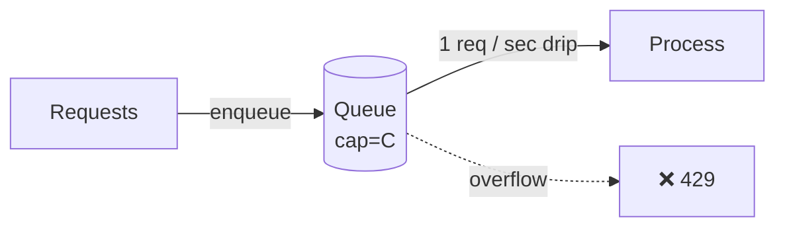
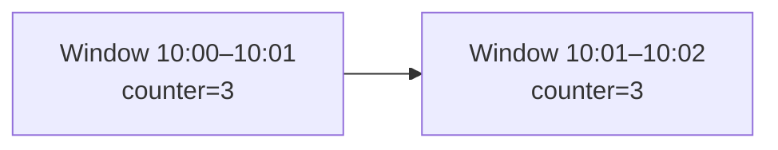
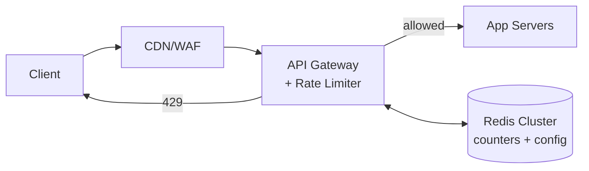
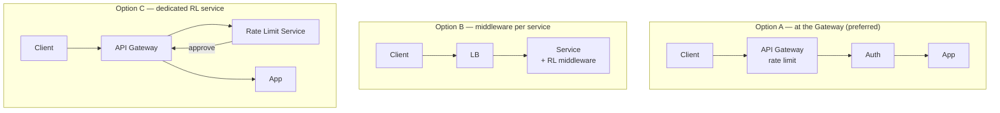

# Design: Rate Limiter

> **TL;DR** — Every public API needs rate limiting to protect against abuse, bursts, and runaway clients. Five algorithms compete on **memory, burst tolerance, and fairness**. The **Sliding Window Counter** is the best general-purpose default; **Token Bucket** is common where bursts are expected.

## Key Takeaways

- **Rate limiting = quotas per identity** (IP, user, API key) over a time window.
- **Token Bucket** handles bursts naturally; **Leaking Bucket** smooths them out.
- **Fixed Window** is simple but suffers **boundary bursts** (2× the limit near window edges).
- **Sliding Window Counter** is the practical winner: cheap, fair, burst-resistant.
- **Distributed rate limiting** usually = Redis + Lua scripts (for atomicity).
- **Place the limiter at the edge** (API Gateway) — stop bad traffic before it reaches app servers.

## Why Rate Limit?

- **Prevent DDoS / abuse** — a single IP flooding your API.
- **Protect downstream services** — avoid overwhelming slow backends.
- **Enforce quotas** — per-plan limits (free: 60 req/min, paid: 1000).
- **Cost control** — keep cloud bills predictable.
- **Fairness** — one noisy user shouldn't starve others.

## Design Axes

Rate limits are usually expressed as `N requests per T seconds`, scoped to:
- IP address
- User ID / API key
- Endpoint-specific (`/login` gets stricter limits)
- Tenant (for multi-tenant SaaS)

## Algorithms

### 1. Token Bucket



- Bucket has a **fixed capacity** C.
- A refiller adds **r tokens per second**, overflow discarded.
- Each request consumes 1 token; if none available → `429`.

**Trace** — cap=3, refill=2/min:
```
t=10:01:01  bucket=2  → success
t=10:01:15  bucket=1  → success
t=10:01:25  bucket=0  → success
t=10:01:35  bucket=0  → 429
t=10:03:01  refill → bucket=2
t=10:03:01  bucket=1  → success
```

- **Pros:** handles bursts up to capacity; standard in AWS/GCP APIs.
- **Cons:** refill rate must be tuned; can still bulk-consume and starve steady users.

### 2. Leaking Bucket



- Fixed-capacity queue; overflow → reject.
- Processed at **constant rate** (the "leak").

- **Pros:** smooth, steady downstream load.
- **Cons:** flattens legitimate bursts; queue latency under sustained load.

### 3. Fixed Window Counter



- Counter per window; reset at window boundary.

```
10:01:01 counter=1 ✅
10:02:15 counter=2 ✅
10:03:25 counter=3 ✅
10:04:35 counter=3 ❌ 429
[new window @ 10:05]
10:05:01 counter=0
```

- **Pros:** dead simple; tiny memory.
- **Cons:** **boundary burst problem** — 3 requests at 10:05:59 + 3 at 10:06:01 = 6 requests in 2 seconds, violating the "per-minute" intent.

### 4. Sliding Window Log

- Store a **timestamp for every request**.
- Drop timestamps older than the window.
- Count remaining; allow if < limit.

- **Pros:** perfectly precise.
- **Cons:** memory grows with request rate; O(logN) ops per request.

### 5. Sliding Window Counter (recommended)

Combines fixed window counters with a weighted sliding estimate.

```
Previous window (8:00:00–8:01:00): 12 requests
Current window (8:01:00–now @ 8:01:45): 5 requests

Estimated requests in last 60s (8:00:45 → 8:01:45):
  = previous_count × ((60 − 45) / 60) + current_count
  = 12 × (15/60) + 5
  = 3 + 5 = 8
```

- **Storage:** 2 counters per key.
- **Pros:** fair, no boundary burst, cheap.
- **Cons:** an approximation (under/over-estimates by a few %).

### Comparison

| Algorithm              | Memory | Burst handling | Fairness | Production notes            |
|------------------------|--------|----------------|----------|-----------------------------|
| Token Bucket           | O(1)   | ✅ Good        | ⚠️ medium| AWS, GCP, Stripe            |
| Leaking Bucket         | O(N queue) | ❌ Smooths out | ✅      | Traffic shaping             |
| Fixed Window           | O(1)   | ❌ Boundary burst | ❌     | Simple internal APIs        |
| Sliding Window Log     | O(N)   | ✅             | ✅       | Precise but expensive       |
| **Sliding Window Counter** | O(1) | ✅          | ✅       | **Best general-purpose**    |

## System Design



### Components

| Component     | Purpose                           | Storage                 |
|---------------|-----------------------------------|-------------------------|
| Counter       | Current usage per key/window      | Redis (hot path)        |
| Config        | Per-endpoint/tier limits          | Redis / central config  |
| Allowlist     | IPs that bypass limits            | Config                  |
| Blocklist     | Banned IPs/users                  | Config                  |

### Where to Place It



- **At the API Gateway** — preferred. Blocks abuse **before** auth, DB, and expensive work.
- **Per-service middleware** — flexible but code duplicated everywhere.
- **Dedicated RL service** — centralized but an extra hop per request.

## Distributed Rate Limiting

For globally-consistent counters across a fleet of gateway instances:

### Challenge
- 10 API Gateway pods behind a LB.
- A single user hits each pod ~equally.
- Each pod's local counter undercounts → the user gets 10× their limit.

### Solution: Redis with Atomic Updates

All pods write to the same Redis key. But `GET`-then-`SET` is not atomic — two pods can each see the same count and both decide to allow.

Use **Lua scripts** (atomic server-side execution) or `INCR` + `EXPIRE`:

```lua
-- token-bucket.lua
local key = KEYS[1]
local cap = tonumber(ARGV[1])
local refill = tonumber(ARGV[2])
local now = tonumber(ARGV[3])

local bucket = redis.call("HMGET", key, "tokens", "last")
local tokens = tonumber(bucket[1]) or cap
local last = tonumber(bucket[2]) or now

local elapsed = math.max(0, now - last)
tokens = math.min(cap, tokens + elapsed * refill)

if tokens < 1 then
    return {0, tokens}
else
    tokens = tokens - 1
    redis.call("HMSET", key, "tokens", tokens, "last", now)
    redis.call("EXPIRE", key, 3600)
    return {1, tokens}
end
```

- Runs atomically in Redis — no race between read and write.
- Latency cost: one extra network hop + script exec (sub-millisecond).

## Responses & Headers

When rate-limiting, return helpful information:

```
HTTP/1.1 429 Too Many Requests
X-RateLimit-Limit: 100
X-RateLimit-Remaining: 0
X-RateLimit-Reset: 1712345678
Retry-After: 15
```

- `Retry-After` tells clients when to try again (seconds or HTTP date).
- Good clients use this; bad clients ignore it (block with firewall).

## Advanced: Adaptive / Dynamic Rate Limiting

- Monitor downstream load (CPU, queue depth).
- Dynamically tighten limits when the system is stressed.
- Open-source: Netflix's **concurrency-limits**, Envoy's **adaptive concurrency filter**.

## Pitfalls

- **Spoofable IPs** (shared NAT, proxies) → prefer API key / user ID.
- **Race conditions** without atomicity → use Lua or `INCR`.
- **Thundering herd** when a popular key expires → refill proactively.
- **Coordinated clients** (IoT fleet) all hit on the second → add jitter client-side.
- **Counting failures separately** → don't block clients being rate-limited by a downstream.

## Real-World Systems

| Product       | Approach                                         |
|---------------|--------------------------------------------------|
| Stripe        | Token bucket; per-API-key; returns clear 429s    |
| GitHub        | Per-user + per-IP quotas; `X-RateLimit-*` headers|
| Cloudflare    | Multiple layers: WAF, DDoS, per-zone rate limits |
| AWS API Gateway | Token bucket per API stage + usage plans       |
| Envoy proxy   | Local or global (via rate-limit service)         |

## Interview-Ready Questions

1. *Which algorithm would you pick?* → Sliding Window Counter as default; Token Bucket if bursts are expected.
2. *Where to place the rate limiter?* → At the API Gateway/edge — cheapest failure mode.
3. *How to make it work across pods?* → Centralized counter in Redis with atomic ops (Lua / INCR).
4. *How does fixed window fail?* → Boundary bursts — 2× the intended limit near window edges.
5. *User is legitimately bursty (e.g. spreadsheet sync) — what algorithm?* → Token Bucket with larger capacity to tolerate bursts.
6. *Rate limiter is down — fail open or closed?* → Fail open (allow) in most cases to avoid a self-inflicted outage; fail closed for security-critical endpoints (login).
