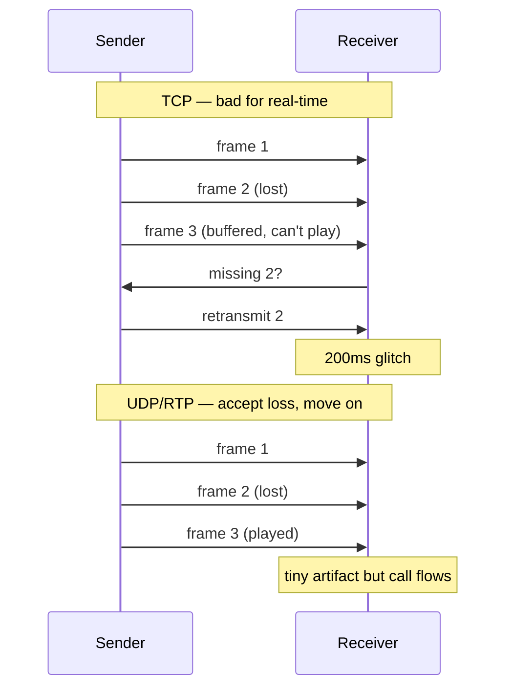
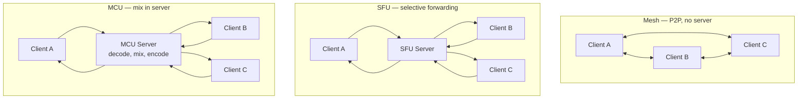
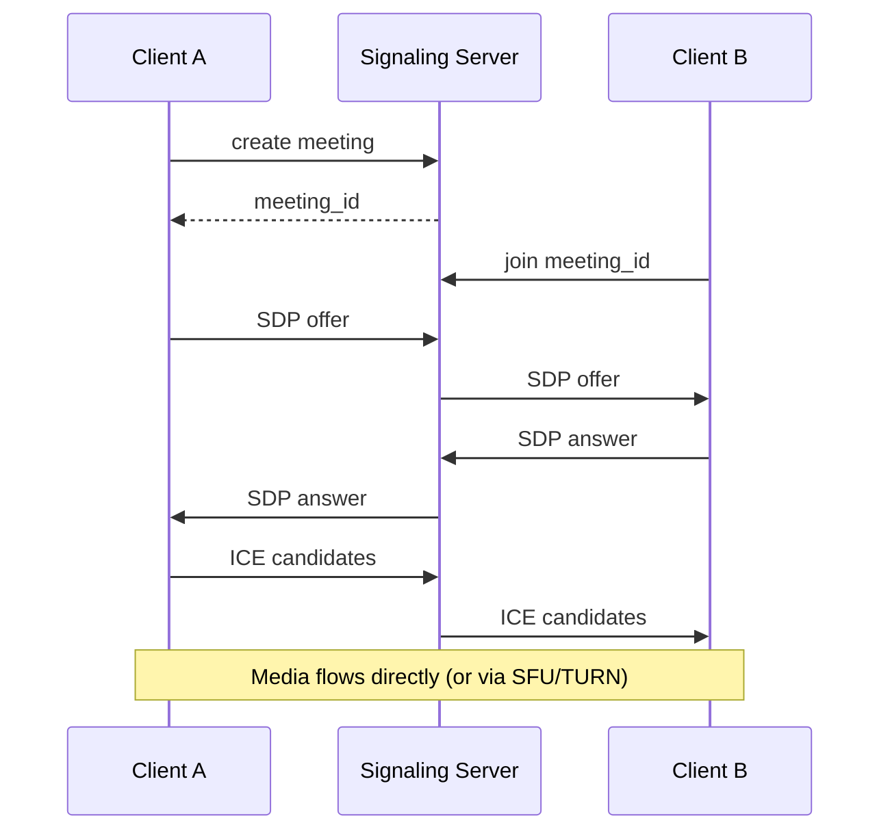
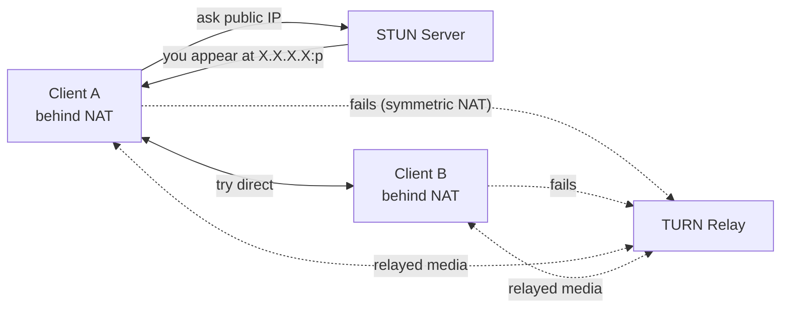
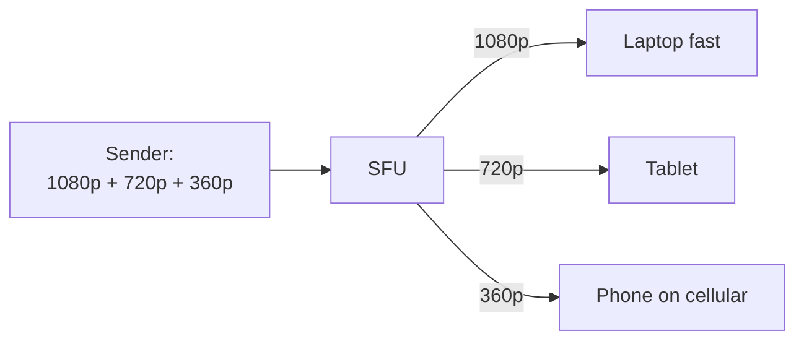
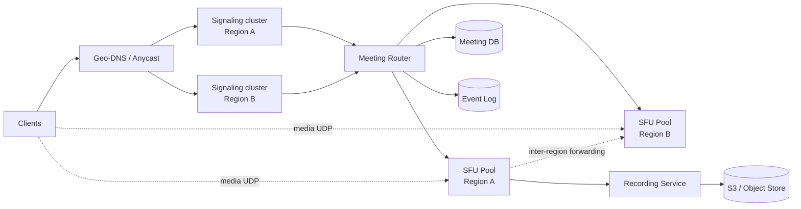

# Design: Zoom / Video Conferencing

> **TL;DR** — Real-time video is a fundamentally different beast from typical web services. You care about **latency (< 150 ms)** more than throughput, use **UDP (WebRTC)** instead of TCP, and choose a **media topology** (mesh / SFU / MCU) based on participant count and device capability. Signaling, NAT traversal (STUN/TURN), and adaptive bitrate are the real engineering challenges.

## Key Takeaways

- **Video calls are UDP-based** — a late frame is worse than a dropped frame.
- **Mesh** works only for tiny groups (≤ 4). **SFU** is the workhorse for medium/large. **MCU** is legacy / specialized.
- **WebRTC** = the browser stack for media; still needs a **signaling server** (WebSocket) to set up the call.
- **NAT traversal** (STUN/TURN) is essential — most users sit behind some NAT.
- **Adaptive bitrate** + **Simulcast / SVC** lets a single sender serve phones and laptops with appropriate quality.
- **Scale via regional media servers** + a global routing layer.

## Requirements

### Functional
- 1-to-1 and group audio/video calls.
- Screen sharing.
- In-call chat.
- Recording (cloud + local).
- Join via link / meeting ID.
- Waiting rooms, host controls, muting.
- Live transcription / captions.

### Non-Functional
- **Latency** — mouth-to-ear < 150 ms (ideal), < 400 ms (acceptable).
- **Availability** — 99.99% for paid tiers.
- **Scale** — millions of concurrent meetings, 1000+ in a single meeting (webinar tier).
- **Security** — E2EE optional (currently opt-in in Zoom).

## Why UDP?

TCP retransmits lost packets. For media, by the time the retransmit arrives the moment has passed — you'd rather **drop that frame** and move on.

Media protocols on top of UDP:
- **RTP** (Real-time Transport Protocol) — carries audio/video.
- **RTCP** — control channel (feedback, quality stats).
- **SRTP** — encrypted RTP.
- **WebRTC** bundles all of these.

## Media Topologies

| Topology | How it works | Client upload | Client CPU | Server cost | Best for |
|----------|--------------|---------------|-------------|-------------|----------|
| **Mesh** | Each peer sends to every other peer | N-1 streams up | Low-med | Zero | ≤ 4 participants |
| **SFU** (Selective Forwarding Unit) | Client sends 1 stream up; server forwards to others | 1 stream up | Low | Medium | Most meetings (Zoom, Meet) |
| **MCU** (Multipoint Control Unit) | Server decodes all streams, mixes into a composite, encodes once | 1 stream up | Very low | High (CPU-heavy) | Low-end clients, SIP interop |

### Why SFU won

- Client only uploads once (good for weak upstream).
- Server doesn't transcode — just forwards packets. Cheap to scale.
- Client downloads N−1 streams but can pick which to render at what quality.
- Enables features like **pinning**, **active-speaker**, **gallery view**.

## Signaling

Signaling is **not** the media path — it's a separate control channel to set up the call.

- **Protocol:** usually WebSocket (persistent + bidirectional).
- **Carries:** SDP (Session Description Protocol) — codec capabilities, media tracks. ICE candidates — reachable IP/ports.

## NAT Traversal — STUN / TURN

Most clients sit behind NAT (home router, corporate firewall). They don't have public IPs. WebRTC uses **ICE** (Interactive Connectivity Establishment) to find a path.

- **STUN** — "What's my public IP?" Cheap; works for most NAT types (~80%).
- **TURN** — Media relay when direct P2P fails (strict NAT, enterprise firewalls). Expensive — all media flows through the TURN server.

## Codecs

| Codec | Type  | Notes |
|-------|-------|-------|
| **Opus** | Audio | Standard for WebRTC; 6–510 kbps, very low latency |
| **VP8/VP9** | Video | Google codecs; VP9 is more efficient |
| **H.264** | Video | Hardware-accelerated on nearly every device; widely licensed |
| **AV1** | Video | Next-gen; 30% more efficient than VP9; emerging in modern clients |

## Adaptive Bitrate & Simulcast

A 4G phone and a fiber-connected laptop in the same call have wildly different bandwidth/CPU. Two techniques handle this:

### Simulcast
- Sender encodes **multiple quality layers** simultaneously (e.g. 1080p, 720p, 360p).
- SFU picks the right layer per recipient based on their bandwidth.

### SVC (Scalable Video Coding)
- Single layered stream; SFU can drop upper layers on the fly.
- More CPU-efficient for the sender, less bandwidth.

## System Architecture at Scale

### Components

| Component | Responsibility |
|-----------|----------------|
| Signaling Server | Meeting lifecycle, SDP/ICE exchange (WebSocket) |
| SFU | Forward RTP between clients; run per-region |
| TURN Server | Relay when P2P fails |
| Meeting Router | Choose best SFU (latency, load) |
| Recording | Ingest streams, encode, store |
| Transcription | Real-time speech-to-text (e.g. Whisper, Google STT) |
| Auth / Identity | Users, permissions, host controls |

### Regional SFUs
- Place SFUs in every major geography.
- Users join the nearest SFU; SFUs interconnect for cross-region meetings.

## Specific Features

### Waiting Room
- Signaling-level gate; participant can't join media until host admits.

### Host Controls (mute, remove)
- Messages over the signaling channel; SFU may block the stream entirely.

### Recording
- Two modes:
  - **Cloud** — SFU forks a stream to a recording service that transcodes to MP4 and uploads to S3.
  - **Local** — client records its own view.
- Must mix audio sources and compose video layouts for playback.

### Screen Sharing
- Just another video track at typically higher resolution, lower framerate.

### Breakout Rooms
- Create sub-meetings; reassign participants to new SFU rooms.

### End-to-End Encryption
- Media encrypted with keys only clients know; SFU sees ciphertext.
- Tricky: SFU can't transcode or do server-side effects; breaks some features (recording, transcription) unless done client-side.

## Scaling Numbers (sanity check)

- 1 SFU machine: ~500–2000 concurrent participants (depending on CPU, bitrate).
- 10M concurrent users / 1000 per box = 10K SFU machines — feasible with cloud autoscaling.
- Bandwidth: 2 Mbps per HD stream × 10M = **20 Tbps** — CDN/edge assist huge.

## Real-World Notes

| System        | Notes                                                           |
|---------------|-----------------------------------------------------------------|
| Zoom          | Proprietary media stack; infamous for efficiency on low-end networks. Huge datacenter footprint. |
| Google Meet   | WebRTC-based; deep Chrome integration; ML for noise cancellation. |
| Microsoft Teams | Based on Skype's stack; tight Office 365 integration.         |
| Discord       | WebRTC for voice; uses Rust + Elixir on backend.                |
| Jitsi         | Open-source SFU (Jitsi Videobridge); reference architecture.    |

## Interview-Ready Questions

1. *Why not TCP?* → Retransmits add latency; late media is useless.
2. *Mesh vs SFU — when?* → Mesh for ≤4; SFU for anything real.
3. *Why is an SFU cheaper than an MCU?* → No transcoding; just packet forwarding.
4. *How do you handle a user on 3G joining a call with laptop users?* → Simulcast — they downloads the 360p layer; they upload a low-bitrate stream.
5. *Why is signaling separate from media?* → Different requirements: signaling is low-volume, durable, TCP. Media is high-volume, lossy-tolerant, UDP.
6. *Latency budget — where do you spend it?* → Capture (~30ms) + encode (~20ms) + network (~50ms) + jitter buffer (~30ms) + decode + render (~20ms) ≈ 150ms.
