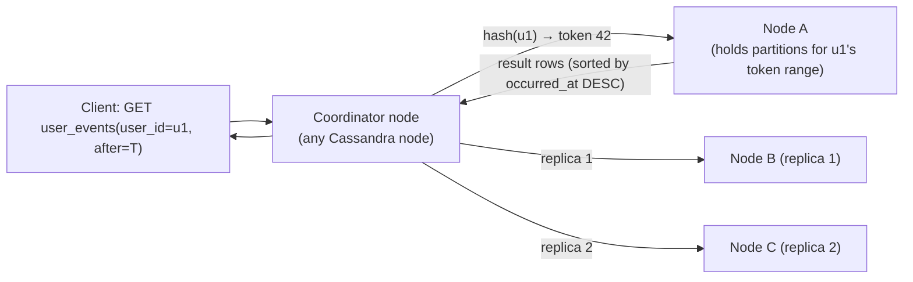
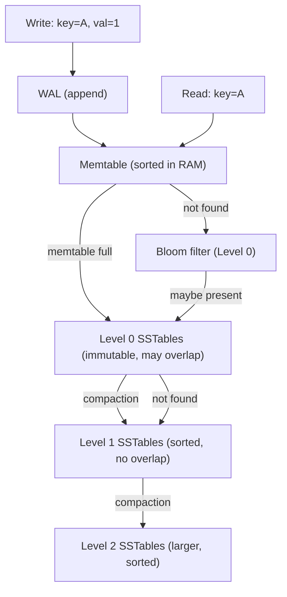

# NoSQL Landscape — Topic 03

> **Session 2026-05-02 (Deep).** Survey of the four NoSQL data models (KV, document, column-family, graph), LSM-tree internals, and the decision framework for picking the right store.

---

## TL;DR

- "NoSQL" means nothing useful. Think in **data models**: KV, Document, Column-family, Graph — each is optimized for a specific access pattern, not just "not SQL."
- **The choice is driven by your read/write pattern, not your data shape.** The biggest mistake engineers make: choosing a DB based on what their data looks like, not how they'll query it.
- **LSM-tree** (used by Cassandra, RocksDB, LevelDB) is the structural reason column-family stores have 10-100× better write throughput than B-tree stores. All writes are sequential appends; compaction pays the price later.
- **Cassandra's data model is its query model.** You design tables around queries, not entities. Getting the partition key wrong means full-cluster scans.
- Most "we need a graph DB" decisions are wrong. SQL with recursive CTEs or a column-family store handles the majority of graph-like queries. Real graph DBs are for deep multi-hop traversals on relationship-heavy data.

---

## Why it exists

### SQL's scaling wall

Relational databases were designed in the 1970s for single machines with a few GB of data. By 2000–2010, companies like Google, Amazon, Facebook, and LinkedIn were storing petabytes across thousands of machines. SQL's foundational assumptions broke:

1. **JOINs require data co-location.** A JOIN between `users` and `orders` works because both tables are on the same machine. Distribute them across 1000 nodes and a JOIN becomes a network shuffle — catastrophically expensive.
2. **Rigid schemas slow down iteration.** Adding a column to a 500M-row table in MySQL takes a multi-hour `ALTER TABLE` with a full table lock. Web products were iterating faster than schemas could evolve.
3. **ACID is expensive at scale.** Two-phase commit across a distributed cluster adds latency and coordination overhead. For use cases that don't need full ACID (e.g., session storage, event logging), this cost is wasted.
4. **Vertical scaling has a ceiling.** The biggest single-node server in 2005 cost ~$100K and topped out at ~64 GB RAM. Google's data was already terabytes. You had to go horizontal, and SQL didn't.

The response wasn't one database — it was a zoo of databases, each throwing away different SQL features in exchange for a specific scaling property. The term "NoSQL" is a marketing accident; "not only SQL" is more accurate but still vague. The right frame: **each NoSQL data model is a bet on what access patterns matter most for a specific workload.**

### The CAP and PACELC context

The theoretical underpinning: Brewer's CAP theorem (2000) — in a distributed system, you can have at most 2 of: Consistency, Availability, Partition Tolerance. Since partition tolerance is mandatory in any real distributed system, the real choice is **CP vs AP**.

- Most SQL databases are **CP**: consistent reads and writes, but they'll fail (become unavailable) rather than return stale data during a network partition.
- Most NoSQL databases are **AP**: always available, always accept writes, but different nodes may briefly see different data.

CAP is oversimplified (see topic 06 — PACELC). But it explains the core trade-off: NoSQL databases traded away some consistency guarantees to get horizontal scalability and availability.

---

## Mental model

**SQL = a spreadsheet with relationships.** Rows, columns, joins, foreign keys. Everything normalized into tables. The storage knows nothing about how you'll query it — indexes are bolted on after.

**NoSQL = a filing system designed around retrieval.** Each data model is a different filing metaphor:

- **Key-Value** = a coat-check counter. "Give me the item for ticket #4291." O(1) lookup, nothing more.
- **Document** = a filing cabinet of folders. Each folder (document) is self-contained JSON/BSON. You can search inside folders, but you can't efficiently compare folders across drawers.
- **Column-family** = a ledger book. Rows are sorted by account (partition key). Within each account, entries are sorted by date (clustering key). Range queries within one account are lightning fast. Queries across accounts are expensive.
- **Graph** = a whiteboard with nodes and arrows. Traversing relationships is the native operation. "Who are Alice's friends' friends?" is a graph walk, not a table scan.

---

## How it works (internals)

### 1. Key-Value stores

**Data model:** `key → value` (opaque bytes). No schema, no query language (usually). Access: `GET key`, `SET key value`, `DEL key`.

**Two flavors:**

| | In-memory KV (Redis) | Persistent KV (DynamoDB, Riak) |
|---|---|---|
| Storage | RAM + optional AOF/RDB | Disk (B-tree, LSM, or hybrid) |
| Latency | Sub-millisecond | Single-digit ms |
| Data size limit | RAM capacity | Petabytes |
| Durability | Configurable | Guaranteed |

**Redis internals (in-memory):**
- All data in a hash table in RAM. O(1) get/set.
- Data structures: strings, lists (linked list or ziplist), hashes (hash table or ziplist), sets, sorted sets (skip list + hash table), streams, HyperLogLog.
- Persistence: **RDB** (periodic snapshot, compact, slow recovery) or **AOF** (append-only log of commands, durable, larger file). Both can be combined.
- Single-threaded command processing → no locking needed → very high throughput (~100K ops/sec on a single instance).

**DynamoDB internals:**
- Fully managed, distributed. Data partitioned by hash of the partition key across many storage nodes.
- Each item is up to 400 KB. No complex queries by default (only by partition key + optional sort key range).
- LSM-tree underneath for write performance. DynamoDB Streams = CDC log.
- Global tables: multi-region active-active with eventual consistency.

**Access pattern:** KV stores are a look-up machine. If your query can be expressed as "give me value for key X," KV is optimal. If you need to query by value, or filter, or aggregate — wrong tool.

---

### 2. Document stores

**Data model:** `collection → document (JSON/BSON)`. A document is a self-contained, nested JSON object. Documents in the same collection don't need the same schema.

**MongoDB internals:**
- Storage engine: **WiredTiger** (replaced MMAP in 3.0). WiredTiger uses a B-tree per collection/index.
- Each document is stored as BSON (binary JSON), which adds type information and allows fast field access without full parse.
- **Indexes:** B-tree indexes on any field path, including nested fields (`address.zipcode`) and array elements (`tags[0]`). Text indexes, geospatial indexes (2dsphere), TTL indexes.
- **Multi-document ACID transactions** (since MongoDB 4.0): uses a two-phase commit mechanism within a replica set, leveraging the oplog. Performance overhead is significant; keep transactions short.
- **Aggregation pipeline:** `$match → $group → $project → $sort` — MapReduce expressed as a pipeline of stages. Runs in the storage engine.

**The schema flexibility double-edge:**
```json
// Document 1 — user profile
{ "_id": "u1", "name": "Alice", "email": "a@b.com", "age": 30 }

// Document 2 — same collection, totally different shape
{ "_id": "u2", "name": "Bob", "preferences": { "theme": "dark", "notifications": [] }, "tier": "premium" }
```

This flexibility is powerful during rapid iteration. The trap: uncontrolled schema evolution creates a collection where every document has a slightly different shape, queries can't use indexes reliably, and application code is littered with null checks. In practice, enforce a schema at the application layer even if MongoDB doesn't require it.

**Access pattern:** Document stores excel when:
- The data is naturally hierarchical (a product has variants, each variant has attributes).
- The unit of access is the full document (you fetch a product page and need everything about that product).
- The schema evolves frequently.
- You rarely need to join across documents.

**What breaks:** multi-document consistency, cross-collection joins, aggregating over fields that aren't indexed.

---

### 3. Column-family / Wide-column stores

**The most misunderstood NoSQL model.** It's NOT "columns in SQL." It's a sorted, distributed map of maps.

**Data model:**
```
Table: events
Row key (partition key): user_id
  Within each row, columns are: {timestamp: event_data, ...}
  Sorted by: clustering key (timestamp)
```

Think of it as: for each partition key (user_id), you have an ordered list of (clustering_key, value) pairs. The partition key determines which node stores the data. The clustering key determines the order within that node.

**Cassandra specifics:**

```sql
CREATE TABLE user_events (
    user_id   UUID,
    occurred_at TIMESTAMP,
    event_type TEXT,
    payload    TEXT,
    PRIMARY KEY (user_id, occurred_at)
) WITH CLUSTERING ORDER BY (occurred_at DESC);
```

- `user_id` = **partition key** → hashed to pick the node. All rows with the same partition key live on the same (replicated) set of nodes.
- `occurred_at` = **clustering key** → sorted order within the partition. Range queries on clustering keys are efficient and local (no cross-node scatter).
- Query: `SELECT * FROM user_events WHERE user_id = ? AND occurred_at > ?` → single-node query. Fast.
- Query: `SELECT * FROM user_events WHERE event_type = 'login'` → full-cluster scatter. **Cassandra will refuse this** (or run it catastrophically slowly) because there's no partition to target.

**The cardinal rule:** In Cassandra, **the table design is the query design.** You create one table per query pattern. This is the opposite of normalization — Cassandra explicitly encourages denormalization.



**Replication:** `replication_factor=3` means 3 copies across nodes. Write consistency `QUORUM` = write to ceil(3/2)=2 nodes before acknowledging. Read consistency `QUORUM` = read from 2 nodes, compare. This gives strong consistency despite being "eventually consistent" by default.

**Tombstones:** DELETEs in Cassandra write a tombstone marker (not an actual delete). Reads must filter tombstones. If tombstone density gets high (lots of deletes on large partitions), reads degrade. For append-heavy workloads (logs, time-series), this is fine. For update/delete-heavy workloads, it's a production hazard.

---

### 4. LSM-tree — the write engine

Most column-family stores (Cassandra, HBase, RocksDB, LevelDB) use an **LSM-tree (Log-Structured Merge-tree)** instead of a B-tree. This is the core reason they have superior write throughput for heavy-write workloads.

**Why B-tree is slow for writes:**

A B-tree UPDATE requires:
1. Read the page containing the key (random read from disk).
2. Modify the page in memory.
3. Write the modified page back (random write to disk).

Random disk writes are ~10ms on HDD, ~0.1ms on NVMe — but even 0.1ms is 100× slower than a sequential write. High insert rates mean many random writes, which fragment pages and cause B-tree splits.

**How LSM-tree works:**

```
Write path:
  1. Write to WAL (durability)
  2. Write to in-memory memtable (sorted, like a BST or skip list)
  3. Return success to client ← this is sequential write + RAM write = very fast

When memtable fills (~64MB):
  4. Flush to immutable SSTable (Sorted String Table) on disk — sequential write
  5. New memtable starts

Background compaction:
  6. Periodically merge SSTables at different levels, resolving newer/older versions
  7. Compaction is sequential I/O — efficient
```



**Trade-off vs B-tree:**

| Dimension | B-tree | LSM-tree |
|---|---|---|
| Write speed | Moderate (random I/O) | Very fast (sequential I/O + RAM) |
| Read speed | Fast (single tree traversal) | Slower (check memtable + multiple SSTables + bloom filters) |
| Space amplification | Low | Higher (multiple versions during compaction) |
| Write amplification | Low (~1 write per update) | High (data written multiple times during compaction) |
| Point lookup | O(log N) in one tree | O(1) with bloom filter, then SSTable search |
| Range scan | Excellent (linked leaves) | Good (within one SSTable) but slower than B-tree at scale |
| Best for | OLTP (balanced read/write) | Write-heavy (logging, time-series, events) |

**Bloom filters** are the LSM-tree's key optimization for reads: a probabilistic data structure that says "this key is DEFINITELY NOT in this SSTable" (zero false negatives) or "this key MIGHT be in this SSTable." They prevent reading entire SSTables for missing keys. Each SSTable has a bloom filter kept in memory.

**Compaction strategies:**
- **Size-tiered (Cassandra default for write-heavy):** merge SSTables of similar sizes. Write-optimized, but read latency can spike during compaction.
- **Leveled (RocksDB default, Cassandra STCS option):** SSTables organized into levels, each level 10× larger than the previous. Better read performance, more write amplification.

---

### 5. Graph databases

**Data model:** Nodes (entities) and Edges (relationships), both with properties. Native graph storage with **index-free adjacency** — each node directly stores pointers to its adjacent edges, rather than going through a join.

**Index-free adjacency (the key differentiator):**

In SQL, finding Alice's friends: `SELECT b.name FROM users a JOIN friendships f ON f.user_id=a.id JOIN users b ON b.id=f.friend_id WHERE a.name='Alice'`. The JOIN scans the entire `friendships` table.

In Neo4j, finding Alice's friends: start at Alice's node, follow `FRIEND` edge pointers directly. No table scan. The cost is proportional to the **number of relationships traversed**, not the total graph size.

For 1-hop: SQL wins (index on user_id). For 3-hop or deeper traversals, graph DBs win dramatically.

**Cypher query (Neo4j):**
```cypher
MATCH (alice:Person {name: 'Alice'})-[:FRIENDS_WITH*1..3]-(person)
RETURN person.name, count(*) as degree
ORDER BY degree DESC LIMIT 10
```

This recursive 1-to-3-hop traversal is trivially expressed in Cypher. In SQL, it requires `WITH RECURSIVE`, and performance collapses beyond 3 hops.

**When to actually use a graph DB:**
- Social network traversals (mutual friends, degrees of separation)
- Recommendation engines (people who liked X also liked Y, based on graph proximity)
- Fraud detection (detect circular payment networks, shared device fingerprints)
- Knowledge graphs (how are entities related?)
- Network/dependency graphs (infrastructure, supply chain)

**When NOT to use a graph DB (most of the time):**
- Most "graph" problems have O(1-2 hop) access patterns → SQL handles fine
- Analytics and aggregation → column-family or OLAP warehouse
- Graph DBs don't scale horizontally well (partitioning a graph without cutting edges is NP-hard)

---

## Trade-offs

### The master comparison

| Dimension | Key-Value | Document | Column-family | Graph | SQL |
|---|---|---|---|---|---|
| Data model | `key → blob` | `collection → JSON doc` | `partition_key → sorted columns` | nodes + edges | tables + rows + joins |
| Write throughput | Very high (Redis: in-memory) / High (DynamoDB) | Medium | Very high (LSM-tree) | Medium | Medium |
| Read (point lookup) | O(1) | O(log N) | O(1) by partition + clustering | O(hops) | O(log N) |
| Read (range) | None (KV) / Sort key range (DynamoDB) | Indexed fields | By clustering key within partition | Traversal | Indexed columns |
| Schema flexibility | None | High (schemaless) | Partial (add columns, not change types) | High | Low |
| Multi-item ACID | No (Redis): yes with transactions / DynamoDB: single-item atomic | Yes (Mongo 4.0+, with overhead) | No (Cassandra: single partition atomic) | Yes (Neo4j) | Yes |
| Horizontal scaling | Easy | Medium | Easy (consistent hashing) | Hard (graph partitioning) | Hard |
| Joins | None | None | None | Native traversal | Yes |
| Best for | Sessions, cache, rate limiting | Catalogs, CMS, user profiles | Time-series, events, IoT, messaging | Social, fraud, recommendations | Transactions, reporting, analytics |
| Worst for | Complex queries, relationships | Multi-doc transactions, aggregations | Ad-hoc queries, secondary index queries | Analytics, large-scale aggregations | Extreme write throughput, flexible schema |

### LSM-tree vs B-tree summary

| | B-tree (SQL, MongoDB) | LSM-tree (Cassandra, RocksDB) |
|---|---|---|
| Write amplification | Low | High |
| Read amplification | Low | Medium (bloom filters help) |
| Space amplification | Low | High (during compaction) |
| Best for | Mixed OLTP, point reads | Write-heavy, append, time-series |
| Latency profile | Predictable | Occasional spikes during compaction |

---

## When to use / avoid

### Key-Value
**Use when:**
- Session storage, auth tokens (fast TTL-based expiry)
- Caching layer in front of a slower DB
- Distributed rate limiting (Redis atomic increment)
- Feature flags, configuration

**Avoid when:**
- Complex queries (you'll end up deserializing everything client-side)
- Data that outlives its simplicity (KV stores resist schema evolution)

### Document
**Use when:**
- The document is the unit of access (product page, user profile, config blob)
- Schema evolves rapidly in early product stages
- Hierarchical data that maps naturally to JSON

**Avoid when:**
- Multi-document transactions are frequent (financial ledger, inventory)
- Heavy aggregation over large collection (OLAP-style queries)
- Relationships between documents are central (you'll rebuild SQL)

### Column-family (Cassandra)
**Use when:**
- Write-heavy: event logs, IoT telemetry, time-series sensor data, activity feeds
- Predictable access patterns (you know your queries at design time)
- Need for linear horizontal scalability with no single point of failure

**Avoid when:**
- Ad-hoc queries (you don't know your query patterns yet)
- Many secondary index queries (Cassandra secondary indexes are slow and local per node)
- ACID multi-row transactions required
- Low data volume (<100M rows) — SQL is simpler and faster

### Graph
**Use when:**
- Core access pattern is multi-hop relationship traversal (>2 hops)
- Relationships are first-class data (properties on edges, not just join tables)
- Data is highly connected: social networks, knowledge graphs, fraud rings

**Avoid when:**
- Single-hop lookups dominate (just SQL with FK indexes)
- Large-scale analytics (graph DBs are not columnar)
- You need easy horizontal scaling (graph partitioning is hard)

---

## Real-world examples

**Twitter (now X) — Timeline storage:** Originally MySQL for tweets, but fan-out to followers at scale required a different model. They moved to a key-value store (Manhattan, their internal distributed KV built on RocksDB) for timeline storage, with each user's timeline as a sorted list of tweet IDs. The access pattern — "give me the 20 most recent tweets for user X" — maps perfectly to KV + sorted set (Redis) or KV + Cassandra clustering key.

**Netflix — Cassandra for activity history:** Netflix uses Cassandra for viewing history, play progress, and A/B test tracking. The partition key is `user_id`, clustering key is `timestamp`. A query like "what did user X watch, in what order, in the last 30 days?" is a single-partition range scan — exactly what Cassandra is built for. Netflix's engineering blog ("Cassandra at Netflix" series) documents multi-region active-active setup using Cassandra's multi-datacenter replication.

**LinkedIn — Espresso (document store for social graph data) + Voldemort (KV for sessions/profiles):** LinkedIn needed different stores for different workloads — session caching (KV), member profiles (document, flexible schema), social graph (specialized graph store internally, not Neo4j). Using one database for all three would have been the wrong trade-off for each.

**Uber — Schemaless (document-like on top of MySQL) → then Cassandra:** Uber's trip data was initially stored in MySQL with a flexible JSONB column ("Schemaless"). As writes grew to billions of rows, they adopted Cassandra for trip/event data. The append-heavy nature of trip events (location pings every 5 seconds per active trip) is exactly the LSM-tree write pattern.

**Airbnb — Elasticsearch (inverted index) as a document + search hybrid:** Property listings need full-text search (description matching), geo queries (within 10 km of Paris), and faceted filtering (price range, bedrooms). Elasticsearch, which is built on Lucene's inverted index, handles all three. It's not a "NoSQL" in the traditional sense but illustrates that sometimes you need a specialized store for a specific access pattern.

**RocksDB** (Facebook) — the embedded LSM-tree storage engine used by Cassandra, TiKV, CockroachDB, MySQL MyRocks, and dozens of others. It's the "Linux kernel of LSM engines" — a building block, not a product.

---

## Common mistakes

- **Treating NoSQL as a scaling cure-all.** NoSQL doesn't scale by magic — you're trading away features (joins, transactions, flexible queries) for specific scaling properties. Picking NoSQL without understanding which properties you're trading is how you get a slow, hard-to-query mess.
- **Designing a Cassandra table like a relational table.** "I'll add a secondary index for every column I might query" → Cassandra secondary indexes are node-local, not global. A query on a secondary index becomes a scatter-gather across all nodes. Design around partition + clustering keys first.
- **"MongoDB for everything because JSON."** MongoDB is excellent for its use case. For financial transactions, for write-heavy time-series, for deep graph traversals — it's the wrong tool.
- **Ignoring tombstones in Cassandra.** High-volume delete workloads on Cassandra generate tombstones that accumulate until compaction. Reading through millions of tombstones per partition causes serious read degradation. For time-series data with TTL, use Cassandra's built-in TTL rather than explicit deletes.
- **"NoSQL means no ACID."** False. DynamoDB has single-item conditional writes (atomic). MongoDB 4.0+ has multi-document ACID. Cassandra has lightweight transactions (LWT) via Paxos for single-partition linearizability. The trade-offs are real but not absolute.
- **Using a graph DB because "the data has relationships."** All data has relationships. A SQL `users → orders → products` relationship is three tables with FK indexes — perfect SQL territory. Use a graph DB only when the traversal depth and relationship complexity exceed what SQL handles gracefully.
- **Picking a document DB because you have "flexible data."** The flexibility becomes a liability in 12 months when you have 8 different document shapes in one collection and can't write a reliable query.
- **Not understanding LSM-tree compaction's effect on latency.** Cassandra (and RocksDB) have periodic compaction operations that compete with reads/writes. In production, compaction can cause latency spikes if `concurrent_compactors` is misconfigured or disk is near capacity. Monitor `SSTableCount` and `CompactionBytesWritten`.

---

## Interview insights

**Typical questions:**

- "Design a system for X — what database would you use?" → The setup for every NoSQL trade-off discussion.
- "When would you use Cassandra over Postgres?" → LSM-tree write throughput, append-heavy, known access patterns, no ad-hoc queries.
- "How does a column-family store differ from a relational DB?" → Data model, partition key, clustering key, LSM vs B-tree.
- "What is an LSM-tree and why do write-heavy databases use it?" → Sequential writes vs B-tree random writes, memtable + SSTable + compaction.
- "Your IoT platform ingests 10M sensor readings/day from 50K devices. Pick a database and defend it." → Cassandra: partition by device_id, cluster by timestamp, LSM-tree write throughput.
- "Why would you NOT use MongoDB for a financial system?" → Multi-document ACID is expensive; schema flexibility is a liability for audited financial data; SQL's transactional guarantees are better suited.

**Follow-ups interviewers love:**

- "You picked Cassandra. What happens if I query by a column that's not in the partition key?" → Full-cluster scatter. Either create a second table for the alternate access pattern, or use Cassandra's materialized views (with caveats).
- "What is a Cassandra tombstone and when does it hurt you?" → Delete marker, accumulates until compaction, degrades reads on high-delete-rate partitions.
- "DynamoDB vs Cassandra — same data model?" → Conceptually similar (KV + sort key) but DynamoDB is fully managed, serverless-friendly, limited secondary index options; Cassandra is self-hosted (or Astra), more flexible schema, better for known access patterns at high volume.
- "Walk me through an LSM-tree write." → WAL → memtable → SSTable flush → compaction. Know the bloom filter's role.
- "Is Redis a NoSQL database?" → It's an in-memory data structure server. Often called a KV store, but it has richer types (sorted sets, streams). It's not a primary DB for large datasets; it's a speed layer.

**Red flags to avoid saying:**

- "I'd use MongoDB because it's flexible" — without knowing the access pattern.
- "Cassandra is just a distributed MySQL." — Wrong data model, wrong storage engine.
- "NoSQL is eventually consistent" — Too broad. Cassandra with QUORUM is strongly consistent. DynamoDB with conditional writes is linearizable per item. "Eventually consistent" is a setting, not a property of the category.
- "I'll use a graph database for our social network" without noting that most social graph queries are 1-2 hops and SQL handles them fine.
- "NoSQL doesn't support ACID" — Demonstrably false post-2018.
- Claiming Cassandra can do ad-hoc queries efficiently. It can't. That's the defining limitation.

---

## Deep dive: LSM-tree compaction strategies (added 2026-05-09)

### Why compaction exists

Without compaction, SSTables accumulate endlessly. Reads check every SSTable (bloom filter first, then binary search). With 500 SSTables, false positive rate compounds. Stale key versions waste disk. Compaction = garbage collector of LSM-trees.

### Strategy 1: Size-Tiered Compaction (STCS) — Cassandra default, write-optimized

- When N SSTables of similar size accumulate (default: 4), merge into one larger SSTable at next tier.
- Write amplification: ~4-8× (low). Each byte rewritten ~4-8× over lifetime.
- **Pros:** Write throughput maximized. Compaction is lazy — fewer cycles = less I/O competition.
- **Cons:** Temporary space amplification up to **2× data size** during merge. Read amplification grows (overlapping key ranges within tiers). p99 read latency unpredictable during compaction storms.
- **Production failure mode:** Disk fills during compaction → compaction stops → SSTables accumulate → reads collapse.

### Strategy 2: Leveled Compaction (LCS) — RocksDB default, read-optimized

- SSTables organized into levels, each 10× larger. **Key invariant: within each level (except L0), SSTables have NON-OVERLAPPING key ranges.**
- When a level exceeds its size limit, one SSTable merges with overlapping SSTables in the next level.
- Read amplification: ~1 SSTable per level (bounded, predictable).
- Write amplification: ~30-50× (each merge into level L+1 touches ~10 SSTables because L+1 is 10× larger).
- **Pros:** p99 read latency predictable and low. Space amplification only ~10%.
- **Cons:** Write amp 4-10× higher than STCS. Under extreme write load, compaction falls behind ("write stall" in RocksDB — writes block entirely at L0 trigger threshold).

### Head-to-head

| Dimension | STCS | LCS |
|---|---|---|
| Write amplification | Low (~4-8×) | High (~30-50×) |
| Read amplification | High | Low (1 SSTable/level) |
| Space amplification | High (2× during compaction) | Low (~10%) |
| p99 read latency | Unpredictable | Predictable |
| Best workload | Write-heavy append-only | Read-heavy or mixed |
| SSD wear | Lower | Higher (watch DWPD ratings) |

### Strategy 3: Time-Window Compaction (TWCS) — for TTL time-series

- SSTables bucketed by time window (e.g., 1 hour). STCS within each window. Expired windows dropped entirely — no compaction I/O.
- Netflix uses TWCS for viewing history (each event has TTL).
- Only works when every row has TTL and no individual updates/deletes.

### Production gotchas

1. **RocksDB write stalls:** L0 SSTable count > `level0_slowdown_writes_trigger` (20) → writes artificially slowed. > `level0_stop_writes_trigger` (36) → writes **block**. Uber hit this in production.
2. **SSD wear:** LCS at 30× write amp on 100 GB/day user data = 3 TB/day actual writes. 1TB NVMe at 1 DWPD burns out in ~4 months.
3. **Cassandra `compaction_throughput_mb_per_sec`** (default 64 MB/s): too low → SSTable backlog → read degradation; too high → steals read I/O. Monitor `CompactionBytesWritten` and `SSTableCount`.
4. **Common pattern:** STCS for append-heavy tables, LCS for read-heavy tables, per-table config in the same cluster.

---

## Related topics

- **02 SQL internals** — B-tree and LSM-tree are the two storage models. B-tree = Postgres/MySQL/MongoDB WiredTiger. LSM = Cassandra/RocksDB/LevelDB.
- **04 Replication** — Cassandra's multi-datacenter replication, DynamoDB global tables, and MongoDB replica sets all build on replication primitives.
- **05 Partitioning & sharding** — Cassandra's consistent hashing for partition assignment is the canonical partitioning example.
- **06 CAP, PACELC** — NoSQL databases differ by their position on the consistency/availability spectrum.
- **07 DB comparison** — Side-by-side: MySQL vs Postgres vs DynamoDB vs Cassandra vs MongoDB vs Neo4j — pick the right tool.
- **08 Caching patterns** — Redis is the canonical caching layer; understanding its data structures informs when it's more than just a cache.
- **09 Redis deep dive** — Full treatment of Redis internals, persistence, cluster, pub/sub, Lua scripting.

## Further reading

- **"Designing Data-Intensive Applications"** — Kleppmann, Chapters 3 (storage engines — the LSM vs B-tree chapter is the canonical reference) and 5-6 (replication + partitioning for distributed NoSQL).
- **"Database Internals"** — Alex Petrov, Part II (distributed systems, Cassandra-style gossip + consistent hashing).
- **Cassandra Data Modeling** — datastax.com/blog/basic-rules-cassandra-data-modeling. The official rules for partition key design.
- **Google Bigtable paper (2006)** — Chang et al. The original column-family design. Cassandra and HBase derive from it.
- **Amazon Dynamo paper (2007)** — DeCandia et al. The original consistent hashing + vector clocks KV paper. DynamoDB derives from it.
- **RocksDB documentation** — facebook.github.io/rocksdb. The authoritative LSM-tree implementation reference.
- **"Why you should never use MongoDB" (2013)** — Antirez + the rebuttals. Read both sides; the issues it raised (now largely fixed) illustrate how NoSQL databases mature.
