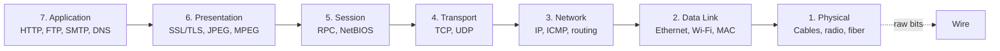
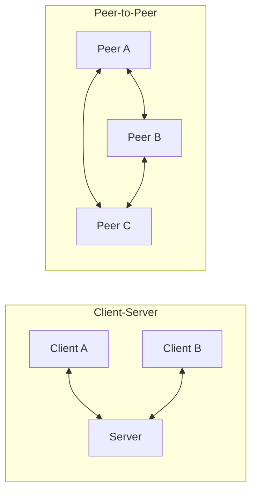
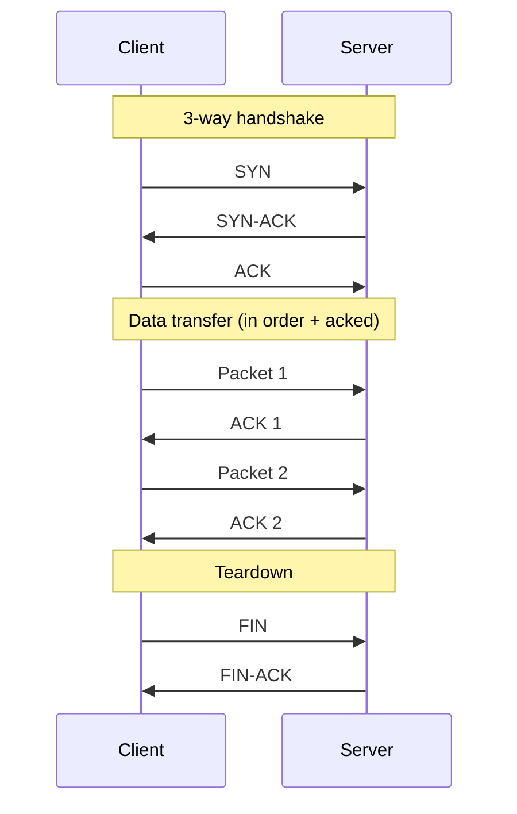
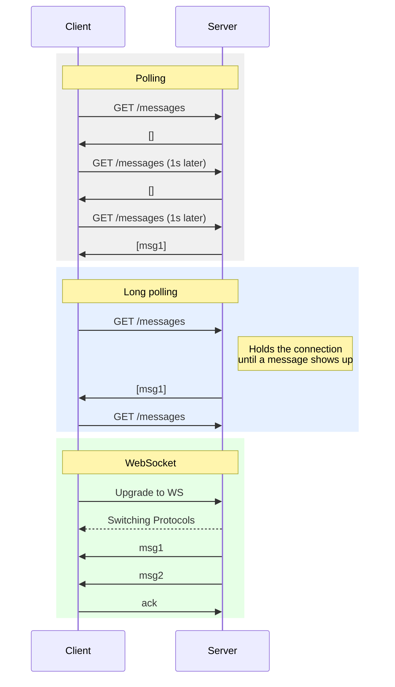
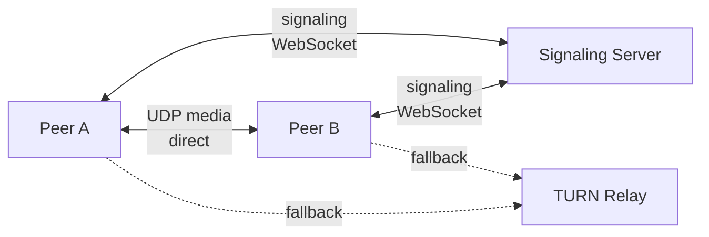

# Network Protocols

> **TL;DR** — The internet is built in layers. Each layer does one job and hides the mess below it. Pick your protocol based on **what matters most to you**: safe delivery (TCP), speed (UDP), live back-and-forth (WebSockets), or browser-to-browser (WebRTC).

## Key Takeaways

- The **OSI model** is just a way to think about networks. What actually runs on the internet is TCP/IP, which has 4–5 layers.
- **TCP** = safe, in-order, a bit slower. **UDP** = fast, but packets can be lost or arrive out of order.
- **HTTP** is ask-and-answer only — it's a bad fit when the server needs to push. Use **WebSockets** when both sides need to talk any time.
- **WebRTC** is the one browser-to-browser option people actually use — it powers Zoom, Google Meet, Discord voice.
- The protocol you pick shapes the whole system. A chat app using polling and one using WebSockets are two very different things.

## The OSI Model

A way to split networking into **seven layers**, each with one clear job. Each layer only talks to the layer right above and right below it.



| Layer         | Example Protocols | Job                                  |
|---------------|-------------------|-------------------------------------------------|
| Application   | HTTP, FTP, SMTP, DNS | The things apps and users see directly |
| Presentation  | SSL/TLS, JPEG     | Translate, encrypt, compress            |
| Session       | RPC, NetBIOS      | Start, manage, and end sessions             |
| Transport     | TCP, UDP          | Get data from one app to another, safely or fast        |
| Network       | IP, ICMP          | Find a path across networks     |
| Data Link     | Ethernet, Wi-Fi   | Move data to the next machine on the wire           |
| Physical      | Cables, fiber     | Actually send the bits                             |

### Why layers matter

- Each layer can change on its own. HTTP/2 can replace HTTP/1.1 without touching Ethernet.
- Debugging gets easier — you can figure out *which layer* is broken (Is DNS wrong? Is the TCP connection stuck? Is SSL failing?).
- **In real life:** when you open `google.com`, DNS (app) turns the name into an IP (network), TCP (transport) opens a connection, TLS (presentation) encrypts it, HTTP (app) carries the request, Ethernet (data link) moves it around your LAN, and the cable or radio (physical) actually sends the bits.

### Explained like you're 10 — the post office story

Imagine you want to send your grandma a birthday card with **100 stickers**. Grandma lives far away in another city. You've never mailed anything before. Let's figure this out.

#### Step 1: Write the card (Layer 7 — Application)

You write "Happy Birthday Grandma, I love you!" and stack your 100 stickers. **This is your actual message.** You don't think about trucks, planes, or sorting centers. You just care about what you're saying to grandma.

> **In real networking:** HTTP, WhatsApp protocol, email (SMTP), RPC calls — these are all "what the app is saying." If you're using **RPC**, your message might be: "Hey grandma, please bake cookies and tell me how many." It's like asking grandma to run a task and send back an answer. HTTP is similar: "GET me the homepage" → server returns HTML.

#### Step 2: Put it in secret code (Layer 6 — Presentation / SSL/TLS)

You worry about a nosy mailman reading your card. So you and grandma agreed on a **secret code** last summer: every letter shifts by 3 (A→D, B→E...). Now your card reads "KDSSB ELUWKGDB" — gibberish to anyone else.

> **In real networking:** this is exactly what **SSL/TLS** does. Before sending any HTTP data, your phone and the server agreed on a secret key (during the TLS handshake). Everything after that is scrambled. That's why it's called HTTPS — the "S" is the secret code layer. Hackers sniffing your Wi-Fi only see gibberish.

#### Step 3: Your post office account (Layer 5 — Session)

Your family has an account with the post office. You scribble "Account #42, Smith Family" so the post office knows who's sending and can bill you. They also remember you sent a card yesterday — that's a continuing relationship.

> **In real networking:** when you log into WhatsApp or Gmail, the server gives you a session token. Every message carries that token so the server knows "this is still Satyam, same guy from 10 minutes ago." No need to re-login for every message.

#### Step 4: Split into envelopes and number them (Layer 4 — Transport / TCP)

**100 stickers don't fit in one envelope.** So you grab 10 envelopes and put 10 stickers in each. You write on them:
- "Envelope **1 of 10**, from Satyam, to Grandma"
- "Envelope **2 of 10**, from Satyam, to Grandma"
- ... and so on

**Why number them?** Because envelopes might arrive at grandma's house out of order! Envelope 7 might go via truck, envelope 2 via plane. Grandma needs to know how to stack them back correctly.

**Why your return address?** If grandma is missing envelope 3, she needs to tell you to resend it.

> **In real networking:** This is **TCP**. It breaks your big message into small chunks called **segments**, numbers them with **sequence numbers**, writes both source and destination addresses, and keeps track of what's been delivered. If your message is small (like "Hi mom"), it fits in 1 segment. If it's a video file, it's millions of segments.

#### Step 5: Write grandma's home address (Layer 3 — Network / IP)

On every envelope, you write:
> Mrs. Grandma Smith
> 42 Maple Street
> Chicago, IL 60601

This address tells **any post office in America** how to get closer to grandma. A post office in Seattle sees "Chicago" and says, "Send it east." A post office in Ohio says, "Chicago is northwest of here."

> **In real networking:** This is the **IP address**. WhatsApp's server has an IP like `157.240.22.53`. Every router on the internet knows "packets for 157.x go to Facebook's network." Your home router, your ISP router, backbone routers — they all look at the IP and pass it toward the destination. **The IP address stays the same on every envelope from start to finish.**

#### Step 6: The "next stop" sticker (Layer 2 — Data Link / Ethernet)

Here's a cool thing. When your local post office ships the envelope out, they slap a sticker on it: **"Next stop: Kansas City sorting hub."** When it gets to Kansas City, that sticker is removed and replaced with **"Next stop: Chicago sorting facility."** At Chicago: **"Next stop: Maple Street delivery van."**

Each sticker only tells you the **very next place** — not the final destination (that's already on the envelope as the address).

> **In real networking:** this sticker is a **MAC address**. Every router and switch along the path reads the MAC to know "which cable do I push this out of next?" Then it writes a new MAC for the next hop. The IP address stays the same all the way, but the MAC address changes at *every single hop*.

> **Quick analogy:** IP = grandma's permanent home address (never changes). MAC = "next stop" sticker that gets rewritten at every post office along the way.

#### Step 7: The actual truck, plane, or train (Layer 1 — Physical / Fiber, Wi-Fi, Ethernet cable)

The envelope physically moves. Sometimes in a mail truck, sometimes a cargo plane, sometimes a train.

> **In real networking:** this is the physical stuff. **Wi-Fi** = radio waves through the air. **Ethernet cable** = electrical signals through copper. **Fiber optic** = pulses of light through glass strands. All three carry the same 0s and 1s — just using different physics. Fiber is fastest and used for long distances (undersea cables, city-to-city backbones).

---

### Putting it all together — the full journey of one envelope

You've packed envelope #3. Here's everything that happens:

```
Your card (100 stickers)           ← L7: The actual message
  ↓ wrapped in secret code (TLS)   ← L6: Nobody can peek
  ↓ split into envelope "3 of 10"  ← L4: TCP segment
  ↓ with grandma's address         ← L3: IP packet
  ↓ and "next stop" sticker        ← L2: Ethernet frame
  ↓ loaded on a truck              ← L1: Physical bits
```

**At every post office (= router):**
1. Peel off the "next stop" sticker (L2).
2. Look at grandma's address on the envelope (L3).
3. Decide which truck goes closer to Chicago.
4. Slap a new "next stop" sticker on (L2).
5. Load it on that truck (L1).

Routers **never open the envelope** itself. They don't read your card, they don't care about the secret code, they don't look at the envelope number. They only look at grandma's address. That's why routing is fast.

**At grandma's house (= destination server):**
1. Truck delivers envelope (L1).
2. Peel off the final "next stop" sticker (L2).
3. Confirm grandma's address matches (L3 — "yep, that's me").
4. Check the envelope number — she got 1, 2, 4, 5... where's 3? (L4).
5. Apply the secret code decoder (L6).
6. Read the card (L7) — "Happy Birthday Grandma!"

---

### How packets actually reach the data center

Let's trace one envelope from your phone to WhatsApp's data center in detail.

**Starting point: Your phone, on home Wi-Fi.**

1. **Your phone asks: "Do I know WhatsApp's IP?"**
   - If cached, great. If not, do a **DNS lookup**: `chatd.whatsapp.net` → `157.240.22.53`.
   - DNS is like calling 411 directory service: "What's the address of WhatsApp?"

2. **Your phone asks: "Is WhatsApp on my local network?"**
   - Your local network is `192.168.1.x`. WhatsApp is `157.240.x.x`. Not local.
   - So: send it to the **default gateway** (your Wi-Fi router at `192.168.1.1`).

3. **Your phone asks: "What's my router's MAC address?"**
   - It shouts on the local network: "Who has `192.168.1.1`?" (This is **ARP**.)
   - Your router replies: "Me! My MAC is `aa:bb:cc:11:22:33`."
   - Your phone builds the packet with: Dest MAC = router's MAC, Dest IP = WhatsApp's IP.

4. **Wi-Fi radio sends the packet to your router.**
   - Radio waves carry the bits across the room to your router.

5. **Your router: "I don't know WhatsApp. Let me send it to my ISP."**
   - Router looks at Dest IP (`157.240.22.53`), not local. Forwards to ISP's router.
   - Rewrites the "next stop" MAC sticker: now it says "next stop = ISP router."
   - Leaves the IP address alone.

6. **ISP router: "Where does `157.240.x.x` live?"**
   - It has a huge routing table (learned via **BGP** — the protocol ISPs use to share "I know how to reach this IP range").
   - It sees: "157.240.x.x is in Facebook's network. Send it to the fiber link going to their peering point."
   - Rewrites the MAC sticker again.

7. **Backbone routers: "Next hop, next hop, next hop..."**
   - The packet hops through 10–20 routers. Each one:
     - Reads the destination IP.
     - Looks at its routing table.
     - Forwards to the router that's one step closer.
     - Decrements **TTL** by 1 (starts at 64 or 128 — prevents infinite loops if routing is broken).
   - You can see this with `traceroute chatd.whatsapp.net` on your terminal.

8. **WhatsApp's edge router: "This is for me!"**
   - It receives the packet. Dest IP matches something in their data center.
   - It forwards it to an internal **load balancer**.

9. **Load balancer: "Which chat server handles this user?"**
   - Picks one out of thousands of chat servers (based on hash, or least-loaded).
   - Forwards to that specific server.

10. **Chat server receives the packet.**
    - Strips Ethernet header (L2 done).
    - Sees its own IP, strips IP header (L3 done).
    - Hands to TCP stack, which checks sequence number and sends ACK back (L4).
    - Hands to TLS layer, decrypts (L6).
    - Hands to WhatsApp application, which reads the message (L7).

The whole round trip takes ~50–200 milliseconds, even though the packet may have crossed an ocean.

---

### How TCP retries when packets get lost

Now the fun part. The internet is messy. Packets get lost in busy routers, dropped by flaky Wi-Fi, corrupted by cosmic rays (really). TCP is what makes the internet *feel* reliable.

**The setup: you sent 10 envelopes to grandma.**

She receives envelopes 1, 2, 4, 5, 6, 7, 8, 9, 10. But **envelope 3 never shows up.**

#### How grandma tells you something's missing

Every time grandma receives an envelope, she sends you a tiny postcard back that says: **"Got it! Last complete envelope was #2, now waiting for #3."**

- Envelope 1 arrives → postcard: "Waiting for #2" (this is the **ACK**)
- Envelope 2 arrives → postcard: "Waiting for #3"
- Envelope 4 arrives (but 3 is missing!) → postcard: **"Still waiting for #3"** (the ACK doesn't advance — grandma repeats the same "waiting for 3" message)
- Envelope 5 arrives → postcard: "Still waiting for #3"
- Envelope 6 arrives → postcard: "Still waiting for #3"

You're sitting at home, sending envelopes. Suddenly you start getting a bunch of postcards all saying **"Waiting for #3."** Three identical postcards in a row? That's a **duplicate ACK**, and TCP treats it as a red flag: "envelope #3 is probably lost, resend it NOW." This is called **fast retransmit**.

#### What if grandma never sends any postcard back?

Maybe she got nothing at all. You're sitting with a stopwatch. When you sent envelope #3, you set a timer for ~200ms (the **retransmission timeout, RTO**). If the timer rings and you haven't heard back, you assume envelope #3 died in the mail.

You **resend envelope #3** from your copy (yes, TCP keeps a copy of every unsent-yet-unacked segment in memory).

If it still fails, you wait twice as long, then try again (**exponential backoff**: 200ms, 400ms, 800ms, 1.6s...). After too many failures, TCP gives up and tells the app "connection dead."

#### Why doesn't the network just "pause" for the slow packet?

It doesn't need to — the receiver (grandma) **buffers** out-of-order envelopes. She holds on to envelopes 4, 5, 6, 7 in a stack on her desk. Once #3 finally arrives, she sorts them all correctly: 3, 4, 5, 6, 7.

But here's the problem with classic TCP: even though 4-7 are sitting on grandma's desk, **the app can't read them yet.** Why? Because TCP promises "in-order delivery." The app doesn't get envelope 4 until envelope 3 is filled in. This is called **head-of-line blocking** — one missing packet blocks everything behind it.

> **This is why HTTP/3 uses UDP (via QUIC) instead of TCP.** With multiple streams on the same connection, a lost packet for stream A shouldn't block stream B. QUIC solves this by handling ordering per-stream, at the application layer.

#### How does TCP decide the timeout value?

It measures the **round-trip time (RTT)** constantly:
- Send envelope → get postcard back → measure how long that took.
- Smoothed average + some safety margin → RTO.

If grandma is in Tokyo and RTT is 200ms, RTO is ~400ms. If she's next door and RTT is 5ms, RTO is ~15ms. TCP adapts per connection.

#### Flow control: grandma says "slow down!"

What if you send envelopes faster than grandma can read them? She'd drown in paper.

Every postcard grandma sends back includes: **"By the way, I have room for 20 more envelopes on my desk."** This is the **receive window**.

If grandma is slow, the window shrinks: "I only have room for 2 more." You stop sending until she catches up and sends back "Room for 10 more!"

#### Congestion control: the post office is jammed

Separately, TCP watches for signs that **the network itself** is overwhelmed (not grandma — the roads between you). If packets start getting lost, TCP assumes a post office is jammed and **slows down the rate at which it sends new envelopes**. It starts slow (slow start), ramps up, and backs off when losses happen (CUBIC, BBR, etc.).

This is why your download speed on a busy coffee shop Wi-Fi feels like a rollercoaster.

---

### All the protocols you mentioned — who does what

| What it is | Who uses it | What job it does in our story |
|-----------|-------------|-------------------------------|
| **HTTP / HTTPS** | Apps (browsers, mobile apps) | The card itself — "Happy Birthday Grandma!" It's the actual conversation between your app and the server |
| **SSL / TLS** | Anything that wants privacy | The secret code on the card — so no mailman can read it |
| **RPC** | Microservices, internal APIs | Like asking grandma to do a task: "Please bake cookies and tell me the count." Usually runs over TCP or HTTP |
| **TCP** | Most apps | Numbering envelopes, tracking which ones arrived, resending lost ones, slowing down if the network is busy |
| **UDP** | Voice, video, games | Just throw envelopes at grandma and don't check. Faster but some may get lost |
| **IP** | Every computer on the internet | Writing grandma's full home address on each envelope |
| **Ethernet** | Wires inside your house, data centers | The "next stop" sticker on wired connections |
| **Wi-Fi** | Your phone, laptop | The "next stop" sticker on wireless connections |
| **Fiber optic** | Long-distance internet backbone | The actual glass cables under the ocean that carry the envelopes as pulses of light |

**How they stack in one WhatsApp message:**

```
"Hi Mom"                  ← HTTP / WhatsApp protocol (L7)
  ↓ encrypted
TLS wrapped gibberish     ← TLS (L6)
  ↓ chopped + numbered
TCP segment               ← TCP (L4)
  ↓ addressed
IP packet                 ← IP (L3)
  ↓ next-hop sticker
Ethernet frame            ← Ethernet (L2)
  ↓ pulses of light
Fiber optic signal        ← Physical (L1)
```

Every layer sits on the shoulders of the one below it. You only touch HTTP, but HTTP is useless without TLS, which is useless without TCP, which is useless without IP, which is useless without Ethernet/fiber, which is useless without electricity. **All of them must work for one "Hi Mom" to reach your mother.**

### Real-world example — sending a WhatsApp message from phone to laptop

Imagine you type "Hi mom" in WhatsApp on your phone and hit send. Here's what each OSI layer actually does behind the scenes:

| Layer | What happens when you hit "send" |
|-------|---------------------------------|
| **7. Application** | WhatsApp formats your message as a protocol message (text + sender ID + timestamp) and hands it to the OS. |
| **6. Presentation** | The message is encrypted end-to-end (Signal protocol) and compressed — so even WhatsApp's servers can't read it. |
| **5. Session** | Your phone's active session with WhatsApp's server (login + auth tokens) is used to tag this message to your account. |
| **4. Transport** | TCP breaks the encrypted blob into numbered segments and guarantees every byte reaches WhatsApp's server. |
| **3. Network** | Each segment gets wrapped in an IP packet with source IP (your phone) and destination IP (WhatsApp server), then routed across the internet. |
| **2. Data Link** | Your Wi-Fi adapter wraps each packet in an Ethernet/Wi-Fi frame with MAC addresses to reach your home router. |
| **1. Physical** | The frame is converted to radio waves (Wi-Fi) and sent through the air to your router, then as light pulses through fiber to WhatsApp's data center. |

On the other side, your mom's laptop unwraps each layer in reverse — physical signal → frame → packet → TCP segment → session → decrypt → WhatsApp shows "Hi mom" on screen. The beauty: WhatsApp's engineers only worry about layer 7. Everything below is handled by the OS, router, and ISP.

#### What each layer actually *adds* to the packet (and who reads it)

Each layer wraps the previous layer's data with its own **header** (and sometimes a trailer). Think of it like putting a letter inside an envelope, inside a bigger envelope, inside a shipping box. Each wrapper is read and removed by the matching layer on the other side.

```
[ Ethernet | IP | TCP | TLS | "Hi mom" | Ethernet trailer ]
    L2      L3   L4    L6       L7            L2
```

| Layer | Header it adds | What's inside the header | Who reads/uses it |
|-------|---------------|--------------------------|-------------------|
| **7. Application** | WhatsApp protocol fields | Message type, sender ID, chat ID, timestamp | Only WhatsApp's server + recipient's app |
| **6. Presentation (TLS)** | TLS record header | Encryption scheme, session keys ref, MAC | Your phone ↔ WhatsApp server (for transport TLS); E2E keys used by you ↔ mom |
| **4. Transport (TCP)** | TCP header (~20 bytes) | Source port, **dest port (443)**, sequence #, ACK #, flags (SYN/ACK/FIN), checksum | End hosts only (your phone + WhatsApp server). Routers ignore this. |
| **3. Network (IP)** | IP header (~20 bytes) | **Source IP** (your phone), **Dest IP** (WhatsApp server), TTL, protocol=TCP, checksum | **Every router along the path** uses Dest IP to decide the next hop |
| **2. Data Link** | Ethernet/Wi-Fi header + trailer | **Source MAC**, **Dest MAC** (next-hop device only), frame checksum | Only the two devices on the same link (phone ↔ router, router ↔ switch, etc.) |
| **1. Physical** | No header, just bits | — | The NIC/radio/laser |

**Key insight:** MAC addresses change at *every hop* (phone→router→ISP→...→WhatsApp server). But the IP addresses stay the same end-to-end. That's why IP is "logical" (addressing) and MAC is "physical" (delivery).

#### Breaking it down further — answering the real questions

**Q1: How does your phone even know WhatsApp's server IP?**
Before anything, your phone does a **DNS lookup**: `chatd.whatsapp.net` → `157.240.x.x`. DNS itself uses UDP on port 53, talking to your ISP's DNS resolver. This IP gets cached for a while (TTL).

**Q2: How does the first packet leave your phone?**
- Your phone's OS looks at the dest IP (`157.240.x.x`). Is it on my local network? No → send it to the **default gateway** (your Wi-Fi router, e.g. `192.168.1.1`).
- It uses **ARP** ("who has 192.168.1.1?") to find the router's MAC address.
- The frame is built: `Dest MAC = router's MAC`, `Dest IP = WhatsApp's IP`.
- Wi-Fi radio sends it.

**Q3: How does the packet travel from your router to WhatsApp's data center?**
- Your home router strips the Wi-Fi frame, looks at the IP header, sees the destination is not local, and forwards it to your **ISP's router** (rewriting the MAC to the next hop's MAC — but leaving the IPs untouched).
- ISP's router looks up `157.240.x.x` in its **routing table** (BGP-learned routes) and forwards to the next router.
- This repeats across ~10–20 hops. Each router only cares about "what's the next hop for this destination IP?". Run `traceroute chatd.whatsapp.net` to see them all.
- TTL in the IP header decreases at each hop. If it hits 0, the packet is dropped (prevents infinite loops).
- Eventually it reaches WhatsApp's edge router in their data center.

**Q4: What happens once it enters WhatsApp's data center?**
- The edge router forwards to a **load balancer** (e.g., based on IP/port hash or least-connections).
- Load balancer picks one of thousands of chat servers and forwards the TCP connection to it.
- That server's OS:
  1. **L2**: strips the Ethernet frame.
  2. **L3**: sees its own IP — "this is for me" — strips the IP header.
  3. **L4**: TCP reassembles segments in order using sequence numbers, ACKs back to sender.
  4. **L6**: TLS layer decrypts (transport encryption — WhatsApp's TLS keys).
  5. **L7**: WhatsApp server sees the message payload (still E2E-encrypted — WhatsApp can't read content, only metadata like sender/recipient).
- Server looks up mom's online devices and queues/forwards the message.

**Q5: How does mom's laptop get it?**
- If mom's laptop has an open WebSocket/TCP connection to WhatsApp, the server pushes the message down that connection.
- If she's offline, WhatsApp stores it and sends a **push notification** (APNs/FCM) when she comes online.
- Same reverse journey: L7 payload → TLS wrap → TCP segments → IP packets → Ethernet frames → fiber → ISP → home router → Wi-Fi → her laptop.
- Her laptop unwraps each layer, E2E-decrypts with her private key, and WhatsApp renders "Hi mom."

**Q6: What if a packet is lost along the way?**
- TCP's sequence numbers + ACKs catch it. The sender times out waiting for ACK and **retransmits** that segment.
- Routers don't care — they're stateless. TCP at the two endpoints handles all recovery.
- If it were UDP (e.g., a voice call), the packet would just be lost and the app would move on.

**Q7: Why doesn't a router need to understand TLS or HTTP?**
- Routers only read the **IP header** to decide next hop. They don't (and can't, due to encryption) peek into TCP payload.
- This is the whole point of layering — routers stay simple and fast, while endpoints handle correctness, security, and app logic.

## Application Layer — Ways Two Things Can Talk

### Client-Server
One side always asks, the other side always answers.

- **HTTP / HTTPS** — the classic web.
- **FTP** — sending files.
- **SMTP** — sending email.
- **IMAP / POP3** — reading email.
- **WebSockets** — both sides can talk, but it's still one client talking to one server. Two clients **cannot** talk to each other directly over a WebSocket.

### Peer-to-Peer (P2P)
Everyone is both client and server.

- **WebRTC** — live audio, video, and data between browsers.
- **BitTorrent** — file sharing; whoever downloads also uploads.
- **Blockchain networks** — gossip-style P2P.



## Transport Layer — TCP vs UDP

### TCP (Transmission Control Protocol)

**Safe, in order, needs a connection first.** TCP promises that every byte you send will arrive in the right order, or the connection will fail loudly.



- **Handshake:** 3 messages (SYN → SYN-ACK → ACK) before any real data flows.
- **Order:** each packet has a number; if they arrive out of order, they get sorted.
- **Safety:** if a packet isn't acknowledged, it's sent again.
- **Flow control:** the receiver tells the sender how much it can handle, so the sender doesn't flood it.
- **Congestion control:** TCP slows down when the network looks busy (e.g. TCP Reno, CUBIC, BBR).

### UDP (User Datagram Protocol)

**Fast, no connection, no promises.** Send packets and hope for the best. The app has to handle anything that matters.

- No handshake — the first packet already has data.
- No ordering, no resends.
- Much lower delay and overhead.
- Use it when **late data is worse than no data** (live streaming, voice, video, games).

### Side-by-side

| Feature              | TCP                           | UDP                           |
|----------------------|-------------------------------|-------------------------------|
| Connection           | Yes, keeps state              | None                          |
| Handshake            | 3 messages (~1 round trip)    | None                          |
| Order                | Guaranteed                    | Not guaranteed                |
| Safety               | Acks + resends                | Send and forget               |
| Flow control         | Yes                           | No                            |
| Congestion control   | Yes                           | No (do it in the app)         |
| Header size          | 20+ bytes                     | 8 bytes                       |
| Speed                | Slower                        | Faster                        |
| Common uses          | Web, email, APIs, SSH         | Voice calls, games, streaming, DNS  |

### What real products use

| Product            | What it uses      | Why                                                    |
|--------------------|------------------|--------------------------------------------------------|
| Google search      | TCP (HTTP/2)     | Correct results matter more than a few milliseconds    |
| Netflix streaming  | TCP (HLS / DASH) | Uses TCP but switches quality to hide buffering|
| Zoom / Google Meet | UDP (WebRTC)     | A dropped frame is better than a late one              |
| Online FPS games   | UDP              | Position updates happen constantly; old ones are useless |
| DNS lookups        | UDP first        | Query is tiny; easy to retry if it fails               |
| SSH                | TCP              | You need every keystroke to arrive                              |

## Server-to-Client Push — HTTP vs WebSockets vs SSE

A question that comes up a lot: how does the **server send data to a client** without the client asking first?



| Way to do it      | How it works                                                            | Cost                           |
|-----------------|-------------------------------------------------------------------------|--------------------------------|
| Short polling   | Client asks every few seconds.                                          | Wasteful, and slow to react.   |
| Long polling    | Client asks, server holds the connection open until there's news or it times out.   | Still lots of HTTP overhead.           |
| SSE (Server-Sent Events) | One open HTTP stream; server → client only.                  | One direction only.                  |
| **WebSocket**   | One HTTP upgrade, then an open two-way channel.            | Best choice for live two-way chat. |

**Where it's used:**
- **Slack, WhatsApp Web, Discord** → WebSockets for live messages.
- **Stock tickers, trading dashboards** → WebSockets or SSE.
- **Notifications in most SaaS apps** → SSE or WebSockets.

## WebRTC — browsers talking to browsers

WebRTC is special because it lets **two browsers talk directly**, instead of sending all the audio and video through a server.

How it usually works:
1. Both sides connect to a **signaling server** (usually a WebSocket) to swap the info they need (SDP, ICE candidates).
2. A **STUN** server helps each side find out its public IP and port (NAT often hides it).
3. If STUN doesn't cut it (strict NAT or firewall), a **TURN** server passes the media through.
4. Once set up, audio and video flow directly, over UDP.



- **Used in:** Zoom (web), Google Meet, Discord voice, Messenger video calls, most telehealth apps.
- **What's different:** no media server needed for small calls. For group calls, media still goes through a central **SFU** server (see [12-zoom.md](12-zoom.md)).

## HTTP Versions

| Version  | Runs on | Main feature                                                |
|----------|-----------|------------------------------------------------------------|
| HTTP/1.1 | TCP       | One request per connection (pipelining rarely works).      |
| HTTP/2   | TCP       | Many streams sharing one TCP connection.          |
| HTTP/3   | UDP (QUIC)| Fixes TCP's "one lost packet blocks everything" problem; faster handshake (0-RTT).|

**Why HTTP/3 runs on UDP:** TCP's strict ordering means one lost packet stalls *every* parallel stream. QUIC (on UDP) sorts each stream on its own, so one loss doesn't block the others. Google, Cloudflare, and Facebook use it for most of their traffic.

## Interview-Ready Questions

1. *Why not use UDP for everything?* → No safety, no order, no congestion control — you'd have to build all that yourself.
2. *Why not TCP for video calls?* → Resends add delay; by the time the lost frame arrives, the moment is gone.
3. *WebSockets vs HTTP/2 server push?* → WebSocket is two-way and stays open. HTTP/2 push is one-way and often turned off. WebSockets win for chat and live editing.
4. *Why is DNS usually UDP?* → Queries fit in one small packet and are safe to retry. Only switch to TCP for big replies (zone transfers, DNSSEC).
